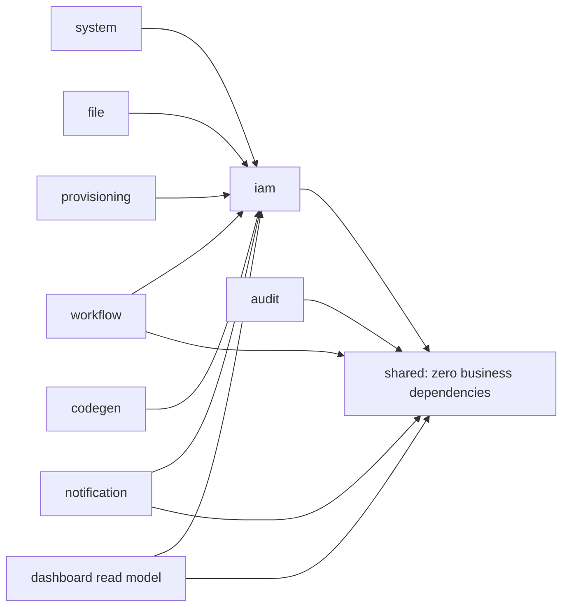

# 后端代码规范审查与结构性优化改造方案

> **2026-09-04 当前执行状态（优先于下文历史快照）**：本文早期章节保留为审查归档，不再作为当前待办或规模基线。本轮第一批和第二批已完成前端质量门禁、`useCrudGrid` 测试与泛型化、普通 CRUD 页面迁移、工作流待办/已办数据库分页、当前页催办聚合和通知收件箱统一数据库分页；同时补充了真实 Redis/Redisson 测试入口和幂等保护不可用时的明确策略。
>
> 本机验证结果：后端 `mvn -Punit-tests verify` 的 186 项快速测试、24 项架构规则和 8 项模块边界规则通过，SpotBugs 高优先级门禁通过；前端 321 项单元测试、类型检查、lint 和生产构建通过。端到端 smoke 用例和真实 Redis/Redisson 集成测试均保留为显式环境门禁；当前机器没有可用 Docker，因此前者 8 项跳过，后者 2 项跳过。
>
> 1. 在 CI 或带 Docker 的环境执行并持续维护真实 Redis/Redisson 集成测试，结合实际慢请求确定幂等租期和续租预算。
> 2. 为已迁移页面补齐业务 DTO 类型，完成登录、验证码、租户切换、授权、强退、工作流审批和代码生成的真实端到端验收。
> 3. 用真实数据量执行工作流候选关系、通知收件箱的 `EXPLAIN` 和压测，确认索引与深分页预算。
> 4. 明确全局用户名唯一性语义，完成完整容器化部署、可观测性、压测和第一个非快照版本发布。
> 5. 预留组件正式启用前完成 Spring Boot、Spring Cloud 和 Spring Cloud Alibaba 版本矩阵验证；暂不拆分微服务。
>
> 下文（除本节）是历史审查证据和设计依据；其中的旧文件数量、行数、问题状态和“待实施”描述不覆盖上述当前状态。后续新增结论应写入本节或单独的变更记录。


> 项目：`enterprise-auth-platform`  
> 审查日期：2026-07-11  
> 源码复核日期：2026-07-12（对照当前工作区源码校正规模数字、行号引用、路径与机制表述）  
> 审查范围：`src/main/java`、`src/main/resources`、`src/test`、`pom.xml`、CI 配置；不包含 `frontend-vben` 与 `.claude/worktrees`  
> 文档性质：静态代码审查与改造设计。除明确标为“已确认”的问题外，性能收益需通过本文的基准方案验证。  
> 统计口径：Java 行数按文件物理行（含空行与注释）；application 分层 import 统计范围为 `modules/**/application/**`。

> **2026-07-12 实施状态更新**：本文第 2 节的规模数字和部分“待实施”描述是首次审查快照，不再代表当前源码。当前 Maven 编译主源码 455 个 Java 文件、测试 66 个 Java 文件；真实 ArchUnit 门禁、会话索引 pipeline/touch 节流、权限版本、Outbox、文件生命周期等已落地。本轮又完成了：会话管理 ID 与 bearer token 解耦、旧权限快照 fail-open 收紧、受限会话分页仅物化目标页、认证请求自定义 Redis 写收敛、Outbox 短事务与超时回收、密码重置 Outbox AES-GCM 加密、仪表盘聚合查询、菜单关联批写、可信代理链解析、审计参数脱敏和请求 ID 统一；随后完成菜单树查询/祖先展开、工作流候选关系批写、本地会话 fallback 的职责抽离，并将 Redis 会话索引读写、脚本、元数据兼容和分页实现抽离至 `RedisSessionIndex`，再以 `UserSessionIndexPort`、`UserAuthorizationInvalidationPort`、`UserAccessControlPort`、`UserPasswordHashPort` 和 `iam.api.DataScopeUserQuery` 切断用户模块对 auth 具体会话、权限失效、当前用户、数据范围和密码实现的直接依赖；Outbox 认领遇到数据库死锁时安全跳过本轮并由下一次调度重试。以上改造保持公开 API、事务边界与批量行为不变。最新验证为完整集成测试 278 项、ArchUnit 11 项和 ModuleBoundary 8 项均通过，`mvn -DskipTests verify` 通过，SpotBugs 高优先级问题为 0。后续决策应以本段及当前源码为准，旧数字仅保留用于追溯首次审查。

> **2026-07-20 实施状态更新（覆盖上一状态）**：当前 Maven 编译主源码 488 个 Java 文件、测试 67 个 Java 文件。新增 `CurrentOperatorSupplier` 以及 file/system/security/dept/menu/role/user/auth 各模块自有的访问控制、引用查询和失效端口；`DataScopeDeptQuery`、`IamRoleQueryPort` 与 `IamRoleUserReferencePort` 已迁入 `iam.api`，`MenuNode` 已迁入 `menu.api`，共享 `TenantProperties` 已从 `tenant.infrastructure` 迁至 `common.context`。这些边界依次清除了 `log/file/system/security/dept/menu/role/user → auth/tenant/user` 等反向实现依赖，并以 auth 侧 `AuthTenantQueryPort` 切断最后的 `auth → tenant` 边；本轮进一步清除了 `user → role` 的 Entity、Mapper、application 和 API 直接依赖，用户角色接口改为返回 user 自有 DTO。静态 import 图中 15 个业务模块的强连通分量现均为单模块，首次审查发现的 12 模块依赖环已经清零；ArchUnit 新增顶层业务模块 `beFreeOfCycles()` 全局门禁和 `user` 禁止依赖 `role` 的防回归规则。最新验证为完整测试 291 项、ArchUnit 23 项和 ModuleBoundary 8 项全部通过；`mvn -DskipTests verify` 通过，SpotBugs 问题为 0，JaCoCo 门禁通过。后续决策应以本段及当前源码为准，旧数字仅用于追溯。

## 1. 结论摘要

当前后端具备可继续演进的基础：使用 Spring Boot 3.5、构造器注入、统一响应与异常处理、Bean Validation、Flyway、多租户拦截、权限注解、Redis 缓存、Micrometer 指标和一定规模的测试。代码也已经按业务模块组织，方向本身是合理的。

但目前尚不能认为“符合生产级最佳实践”，主要原因如下：

1. 存在两个必须立即处理的安全阻断项：版本库中已提交外部 Redis 明文凭据；密码重置链路在默认配置下会记录包含有效 token 的完整重置链接。
2. 已认证请求存在静态可确认的 Redis 写放大。仅自建会话索引的正常刷新就至少包含 7 次直接 Redis 操作，未计 Sa-Token 自身读写。
3. 在线会话页同时存在 Redis N+1 和数据库 N+1。当前单页预扫描上限 200 个会话（`min(size*3, 200)`），逻辑上界约 402 次 Redis 访问；非平台管理员路径上 DataScope 可能再触发最多约 600 次重复 SQL。
4. 工作流待办、已办、角色页和部分用户摘要仍采用“大集合查询后内存过滤/分页”，数据增长后会同时影响延迟、内存和结果正确性。
5. 现有 15 个业务目录并未形成真正的模块边界。12 个核心模块处于同一个强连通依赖分量，现有 `ModuleBoundaryTest` 仍然全部通过。
6. `interfaces / application / domain / infrastructure` 四层目前更多是目录约定。137 个 application 文件中，62 个直接引用 infrastructure 或 MyBatis，共 220 条 import；29 个 application 文件反向引用 interfaces，共 47 条 import。
7. 质量门禁存在“看似启用、实际不阻断”的情况。SpotBugs 审查时报告 292 个中等级别问题，但 `failOnError=false`，构建仍然成功；测试声明了 Testcontainers，却没有实际使用，默认测试配置会访问固定外部服务。

推荐路线不是立即拆微服务，而是：

- 先修安全与测试可重复性；
- 再优化认证、会话、数据权限和列表查询的高频路径；
- 随后用权限版本号、事务 Outbox 和可靠异步替代全量扫描与请求内同步通知；
- 最后将 15 个“伪独立模块”收敛为少量真正的限界上下文，并用 ArchUnit 或 Spring Modulith 固化单向依赖。

## 2. 审查基线

### 2.1 代码规模

| 指标 | 结果 |
| --- | ---: |
| 后端 Java 文件 | 392 |
| 后端 Java 代码行 | 29,785 |
| 测试 Java 文件 | 49 |
| 测试 Java 代码行 | 9,252 |
| 超过 300 行的 Java 类 | 19 |
| 超过 500 行的 Java 类 | 3 |
| application 文件 | 137 |
| 直接引用 infrastructure/MyBatis 的 application 文件 | 62 |
| 上述 application 中 infrastructure/MyBatis import 条数 | 220 |
| 反向引用 interfaces 的 application 文件 | 29 |
| 上述 application 中 interfaces import 条数 | 47 |
| 业务模块目录 | 15，其中 `catalog` 已为空 |
| 最大强连通模块集合 | 12 个模块 |

体积最大的类包括：

- `modules/menu/application/MenuService.java`：当前约 572 行；菜单树算法已抽离至 `MenuTreeResolver.java`；
- `modules/workflow/infrastructure/MybatisWorkflowRepository.java`：512 行；
- `modules/notification/application/NotificationScenarioPublisher.java`：510 行；
- `modules/file/application/FileApplicationService.java`：474 行；
- `modules/system/application/DictApplicationService.java`：471 行；
- `modules/auth/application/SessionIndexService.java`：176 行的公开门面；Redis 实现已抽离至 `RedisSessionIndex.java`（549 行），本地 fallback 位于 `LocalSessionIndex.java`。

### 2.2 已执行的验证

1. 审查当时：`mvn -Dtest=com.enterprise.auth.platform.arch.ModuleBoundaryTest test` 成功，5 个测试全部通过。
2. 上述命令同时完成 392 个主源码和 49 个测试源码的编译。
3. `mvn dependency:analyze` 成功，并确认多项直接依赖没有代码引用。
4. `mvn -DskipTests spotbugs:check` 成功执行，报告 292 个中等级别问题，但由于配置不阻断，最终仍为 `BUILD SUCCESS`（292 为审查时快照；后续以重新执行结果为准）。
5. 未执行完整集成测试。原因不是忽略验证，而是 `src/test/resources/application.yml:10-12` 默认指向带明文凭据的外部 Redis；为避免对外部环境产生读写，本次没有使用该默认配置。完整测试应在完成测试隔离后执行。
6. 2026-07-12 源码复核：文件规模、最大类行数、12 模块 SCC、application 分层 import、P0/P1 关键证据链与下文行号/路径已与当前工作区对齐；Maven/SpotBugs 未重新全量执行。

### 2.3 做得较好的部分

- 业务代码已按功能包组织，而不是传统全局 `controller/service/dao` 平铺。
- 大部分 Bean 使用构造器注入。
- `GlobalExceptionHandler` 不向客户端暴露未知异常堆栈，见 `common/web/GlobalExceptionHandler.java:100-108`。
- 认证接口、管理接口普遍使用 Bean Validation 和 `@SaCheckPermission`。
- 数据库变更统一进入 Flyway，核心查询也已存在一批复合索引。
- UTC、请求 ID、结构化日志、Actuator、Prometheus 已有基础配置。
- 文件上传包含大小、声明类型和文件签名检查，见 `modules/file/application/FileApplicationService.java:216-243`（签名读取与类型探测见同文件后续方法）。
- 缓存已有命名空间和 TTL 策略（`app.cache.namespace-version: v6`），便于后续做兼容数据淘汰。

这些基础应保留，不建议在结构改造中整体推翻。

## 3. 风险与优先级

本文优先级定义：

- P0：生产阻断或敏感数据风险，应立即处理；
- P1：已由静态代码确认的高影响性能、正确性或可用性问题，应进入最近一个迭代；
- P2：结构、依赖和工程治理问题，应在 P0/P1 稳定后分阶段处理；
- P3：需由运行数据决定是否实施的增强项。

| 优先级 | 问题 | 状态 | 主要影响 |
| --- | --- | --- | --- |
| P0 | 测试配置提交外部 Redis 明文凭据 | 已确认 | 凭据泄露、外部数据被误操作 |
| P0 | 默认通知通道会记录完整密码重置链接 | 已确认 | 有效重置 token 进入日志 |
| P1 | 每个认证请求刷新影子会话索引 | 已确认 | Redis RTT、网络和写 CPU 放大 |
| P1 | 在线会话页 Redis N+1 + DataScope SQL N+1 | 已确认 | 高延迟、连接池耗尽、错误总数 |
| P1 | 工作流/角色/用户存在大集合内存分页 | 已确认 | O(N) 内存、SQL 放大、结果截断 |
| P1 | 邮件、对象存储、通知扇出位于事务或请求线程 | 已确认 | 长事务、线程占用、部分失败不一致 |
| P1 | 异步审计无有界执行器和可靠投递 | 已确认 | 高峰积压或丢失审计日志 |
| P1 | 分页入口没有统一上限 | 已确认 | 大查询、整数溢出和资源耗尽 |
| P2（启用前阻断） | Spring Boot 与预留 Cloud 依赖矩阵不兼容 | 已确认 | 启用 `future-components` 前必须先对齐版本 |
| P2 | 12 模块构成强连通依赖环 | 已确认 | 改动扩散、无法独立测试和演进 |
| P2 | 现有边界测试漏检多数违规 | 已确认 | 产生错误的架构安全感 |
| P2 | 泛型 Redis 多态反序列化和旧 Map 兼容层 | 已确认 | 安全面扩大、维护和转换成本 |
| P2 | Redisson 已引入但业务用法尚未落地，配置与 Lettuce 分叉 | 已确认 | 连接/配置双轨；**保留依赖**，补齐配置并接入明确用例 |
| P2 | SpotBugs/测试/依赖门禁不闭环 | 已确认 | 问题持续累积 |
| P3 | 连接池、TTL、索引参数需要按真实负载调整 | 待压测 | 不能只凭静态配置给出最优值 |

## 4. P0 安全整改

### 4.1 已提交的测试凭据

证据：

- `src/test/resources/application.yml:10-12` 包含固定公网 Redis 地址和明文默认密码；
- `src/test/resources/application.yml:3-5` 还包含默认数据库连接与口令；
- 文件当前已被 Git 跟踪，`.gitignore` 对已跟踪文件和历史提交不生效；
- Git 历史中可看到该文件经过多个提交，因此不能只修改最新版本。

立即动作：

1. 轮换 Redis 凭据；若数据库凭据在任何共享环境使用，也应一并轮换。
2. 将测试配置改为无敏感默认值的环境变量，或完全由 Testcontainers 动态注入。
3. 对所有分支和标签运行 secret scan，并根据仓库传播范围决定是否使用 `git filter-repo` 清理历史。
4. CI 增加 Gitleaks、TruffleHog 或平台原生 secret scanning，阻止新凭据进入仓库。
5. 禁止测试默认连接公网地址。缺少容器或显式环境变量时应快速失败，而不是静默访问共享服务。

验收标准：

- 当前文件和 Git 全历史扫描均无有效凭据；
- 本地直接执行测试不会访问公网基础设施；
- 被泄露凭据已失效，而不只是从代码中删除。

### 4.2 密码重置 token 进入日志

证据链：

- `application.yml:171-173` 将通知通道默认值设为 `log`；
- `PasswordResetNotificationService.java:56-59` 在通道不是 `smtp` 时直接进入日志降级（默认 `log` 走此分支）；
- 即使通道配置为 `smtp`，若租户未配置可用邮件渠道，`61-66` 在非 staging/prod 会再次降级到日志；staging/prod 的 `requiresSmtp()` 仅在该分支抛错；
- **关键点**：staging/prod 只要仍使用默认 `channel=log`，就不会进入 `requiresSmtp()`，**仍会记录完整重置链接**；
- `PasswordResetNotificationService.java:99-100` 记录完整 `resetLink`；
- 链接由 `PasswordResetApplicationService.java:154-155` 生成并传入，其中包含一次性原始 token；发送发生在 `@Transactional` 的 `request` 方法内（`84-158`）；
- 该日志走 SLF4J `log.info`，绕过 `LogPublisherImpl` 的敏感字段脱敏逻辑，因此不会被 `resetlink/token` 规则遮盖。

整改方案：

1. 删除任何环境下对原始重置链接和原始 token 的日志记录。
2. local/dev 使用本地邮件捕获器，例如 Mailpit/MailHog；需要诊断时只记录 request ID、用户 ID、token 哈希前缀和过期时间。
3. staging/prod **禁止**将通知通道设为 `log`：缺少可用邮件渠道时 fail-closed（启动校验或健康检查暴露配置问题），不能依赖“仅 channel=smtp 时才检查”。
4. 增加日志捕获测试，断言日志中不出现 raw token、`token=` 参数或完整重置 URL。

验收标准：secret scan 和运行日志抽样均不能还原可用重置链接。

## 5. 高频性能问题与改造

### 5.1 认证请求的 Redis 写放大

当前请求链路：

```text
SaTokenUserContextInterceptor.preHandle
  -> CurrentUserService.bindRequestContext
  -> tokenSession.set(lastAccessAt)
  -> SessionIndexService.touch
  -> 缺索引时 register + touch
  -> SessionIndexService.updateActiveTenant
```

静态操作量：

- `infrastructure/security/SaTokenUserContextInterceptor.java:37-58` 对每个已认证请求无条件刷新时间、索引和活跃租户；
- `SessionIndexService.java:108-115` 的正常 `touch` 执行 `HGET + HSET + EXPIRE + 2 x ZADD`，共 5 次直接 Redis 操作；
- `SessionIndexService.java:133-134` 的 `updateActiveTenant` 再执行 `HSET + EXPIRE`，共 2 次；
- 因此正常请求至少有 7 次自建索引 Redis 操作，另有 `SaSession.set` 和 Sa-Token 自身读写；
- 索引缺失时，首次 touch、register、二次 touch、update 合计约 14 次直接操作；
- `infrastructure/security/SaTokenPermissionProvider.java:37-51,55-65,68-81,146-156` 在请求上下文已经绑定后仍会重新加载用户并多次读取 token session（未优先复用 `AuthContextHolder`）。
- `application.yml:33-39` 配置 Redis 超时 3 秒、池上限 8、`max-wait=-1ms`。在命令放大和连接饱和同时出现时，无限等待会把 Redis 压力传导为请求线程堆积。

这套 `SessionIndexService` 是 Sa-Token 之外的影子索引，主要用于在线会话管理。它不应与每个业务请求保持毫秒级同步。

推荐改造：

1. 请求内只解析一次 token session 和 principal，后续权限判断优先复用 `AuthContextHolder`。
2. 将影子索引 `lastAccessAt` 刷新节流到 30-60 秒。Sa-Token 原生活跃超时仍按原规则执行，不能用影子索引替代安全语义。
3. `activeTenantId` 只在登录和切换租户时写，不在每个请求中重复写相同值。
4. 将必要的索引刷新合并为一次 Lua 脚本或 pipeline，降低网络 RTT。
5. 长期方案是事件驱动索引：登录、登出、强制下线、切换租户更新索引；低频心跳只负责近似最近访问时间。

第一阶段目标：认证简单接口的影子索引 Redis 往返减少至少 70%，同时保持会话超时、强制下线和租户切换回归测试全部通过。

### 5.2 在线会话页的 Redis N+1

证据：

- `SessionIndexService.java:236-256` 先执行 `ZCARD + ZREVRANGE`，再对每个 token 调用 `read`；
- `SessionIndexService.java:306-307` 的 `read` 对每个 token 单独执行 `HGETALL`；
- `SessionApplicationService.java:116-117` 预扫描条数为 `min(size * 3, SESSION_RESULT_LIMIT)`，`SESSION_RESULT_LIMIT=200`，因此单页最多扫描 200 条；
- `SessionApplicationService.java:218-228`（`withActiveState` / `isSessionActive`）又对每条记录调用 `getLoginIdByToken` 检查活跃状态；
- `SessionIndexService.java:199-229` 的可见会话计数按 200 条一页扫描全部在线会话，dashboard 调用也会随总会话数线性增长。

单页逻辑访问约为 `2 + 2N`（索引分页 2 次 + 每 token 1 次 HGETALL + 每 token 1 次活跃检查）。当预扫描取满 `N=200` 时上限约 402 次；默认 `size=10` 时预扫描约 30 条，量级仍随页大小线性放大。除此之外，`SessionApplicationService.java:156` 返回的是索引总数而不是权限过滤后的总数，非平台用户的分页 total 可能不准确。

推荐改造：

1. 对多个 session hash 使用 pipeline 批量读取，避免 N 次网络往返。
2. 按 tenant 和 user 建立独立 ZSet，查询阶段先缩小候选集，而不是全局扫描后过滤。
3. 由索引 TTL/定期清理承担大部分陈旧数据判定，页面查询不要逐条回查 Sa-Token。
4. 使用游标或稳定的 `(lastAccessAt, token)` 排序分页，避免深 offset。
5. total 必须对应调用者可见范围；若精确 total 成本高，应显式改为 `hasMore/nextCursor`，不能返回误导数字。

目标：在线会话列表 Redis 网络往返不随页大小线性增长，建议每页不超过 4-6 个 RTT。

### 5.3 DataScope 在会话循环中重复查库

证据：

- `SessionApplicationService.java:126,176-184` 对每条非本人会话调用 `dataScopeService.canAccessUser`；
- `canAccessUser` → `visibleUserIds` → `buildContext`（`DataScopeService.java:141-148,111-124,170-208`），**请求内无缓存**，循环中每条会话都会重建 `ScopeContext`；
- 每次至少查询当前用户（`181-186`）；`DEPT_AND_CHILDREN` 会再全量查询部门（`221-227`）；非 SELF 范围还会按部门加载可见用户（`204-207` / `211-218`）。

对 N 条需鉴权会话：SELF 约 N 次 SQL，DEPT/CUSTOM 约 2N，DEPT_AND_CHILDREN 约 3N；当预扫描取满且大量会话走 DataScope 时，理论上最多约 600 次重复 SQL。平台超管跳过 DataScope（`platformAdmin || canAccessSessionUser`），该放大主要影响非平台管理员。

推荐改造：

1. 在进入循环前只计算一次可见用户 ID 集合，使用集合判断所有会话。
2. 将 `(principalId, tenantId, authzVersion)` 对应的 ScopeContext 缓存在请求范围；同一请求内的 dashboard、会话和列表复用。
3. 中期将数据范围编译成 SQL 条件或查询端口，避免先加载业务全集再做 Java 过滤。
4. 部门树频繁读取时可缓存结构版本，但权限变更必须通过版本号失效。

目标：会话页 JDBC 查询数不随会话条数增长，稳定在 3-5 条以内。

### 5.4 权限失效采用全量会话扫描

证据：

- `AuthPermissionSnapshotInvalidationService.java:14-15,58-80`：`SESSION_SCAN_MAX_PAGES=100`、`SESSION_SCAN_PAGE_SIZE=200`，最多扫描 `100 x 200 = 20,000` 条会话；
- 每页又通过 `SessionIndexService.page` 逐 token 读取 hash；
- `AuthPermissionSnapshotInvalidationService.java:91-117` 对单用户同时扫描 Sa-Token 会话列表（`91-97`）和自建索引（`102-117`）；
- 菜单、代码生成资源、租户套餐和租户更新都会触发 `invalidateAll` 或 `invalidateTenant`，调用点包括 `MenuService.java:599`、`CodegenResourceRegistrationService.java:75`、`TenantCatalogManagementService.java:248`。

这会让一次菜单或套餐变更的成本与全平台在线会话数成正比，而且经常发生在管理请求线程或事务中。

推荐采用版本化权限：

- `tenantAuthzVersion`：角色、菜单、套餐、租户资源变化时原子 `INCR`；
- `userAuthzVersion/sessionVersion`：用户角色、状态和密码变化时更新；
- 权限快照 key 包含版本号，旧缓存自然失效；
- 会话在下一次权限校验时发现版本不一致并重建快照；
- 若要求秒级失效，可结合 Redis Pub/Sub 或本地短 TTL，而不是同步扫描所有 token。

验收标准：权限变更操作复杂度由 O(在线会话数) 降为 O(1) 或 O(受影响用户数)，并定义权限失效 SLA，例如 1-5 秒。

### 5.5 工作流、角色和用户的大集合查询

#### 工作流

- `WorkflowTaskService.java:27,156-165` 待办先取最多 `TODO_CANDIDATE_LIMIT=500` 条，内存过滤、映射后再分页；
- `WorkflowViewMapper.java:72-90` 每映射一条任务都会调用一次 `countUrges`（`89`）；
- 默认返回 10 条时，也可能产生 1 次列表 SQL 加最多 500 次 COUNT SQL（COUNT 发生在候选集映射阶段，不是仅对最终页）；
- `MybatisWorkflowRepository.java:263-272` 的已办查询没有数据库分页；
- `WorkflowTaskService.java:168-174` 加载全部已办后才内存分页；
- `V1__baseline.sql:812-813` 将候选用户和候选组保存在 JSON（`candidate_user_ids_json` / `candidate_group_codes_json`），现有索引无法高效按候选人查询。

改造：

1. 新增 `wf_task_candidate_user`、`wf_task_candidate_role` 关系表，将候选条件下推 SQL。
2. 已办使用数据库分页，新增与实际过滤和排序一致的复合索引。
3. 催办数按当前页 task IDs 一次 `GROUP BY task_id` 批量查询。
4. 列表查询总 SQL 数控制在 3-5 条，并且不随页大小线性增加。

建议用 `EXPLAIN ANALYZE` 验证以下索引，而不是直接照搬：

```sql
-- 已办候选索引，最终列顺序以真实 WHERE/ORDER BY 为准
(tenant_id, assignee_user_id, deleted, completed_at DESC, id DESC)

-- 规范化候选关系
wf_task_candidate_user(tenant_id, user_id, task_id)
wf_task_candidate_role(tenant_id, role_code, task_id)
```

#### 角色与用户

- `RoleCatalogFacade.java:84-102` 加载全部角色后内存搜索和分页，`PaginationSupport.normalizeSize(size)` 无上限；
- `UserDirectoryService.java:49-50` 的无参列表固定请求最多 10,000 个用户；
- `UserManagementService.java:366-378` 为返回单个用户摘要，调用 `userDirectoryService.listUsers()` 全集查询再过滤；
- 创建、更新、分配角色等写操作都会因此承担不必要的大查询。

改造：增加按 ID 的 `UserSummaryQuery`，角色页使用数据库过滤与分页，所有分页统一限制 `size <= 100`。

### 5.6 外部 IO 与事务边界

#### 密码重置邮件

`PasswordResetApplicationService.java:84-158` 在一个 `@Transactional` 方法中创建 token 后同步调用通知发送；真正的 SMTP 网络发送位于 `TransactionalMailSupport.java:18` 起的 `send`。邮件连接、读、写超时默认各 10 秒，见 `application.yml:153-155`。慢 SMTP 会拉长事务和请求线程占用。

#### 文件存储

- `FileApplicationService.java:55-57,161-202` 在事务方法中先上传对象存储，再插入数据库；
- `FileApplicationService.java:141-148` 在事务方法中先删除远端对象，再软删数据库；
- 上传后数据库失败会产生孤儿对象，删除后数据库失败会产生“记录存在、对象丢失”；
- `modules/file/infrastructure/MinioConfig.java:12-18` 构建 `MinioClient` 时没有显式 HTTP 超时、并发和重试预算。

#### 通知扇出

- `NotificationScenarioPublisher.java:358-376` 的 `afterCommit` 回调仍在原请求线程执行；
- `NotificationPublisher.publish` 使用 `@Transactional(REQUIRES_NEW)`（`54-62`），`doPublish`（`64-127`）在该线程解析收件人并批量写；
- 在线 SSE 用户走逐人 insert + push，见 `NotificationPublisher.java:117-119,197-200`；
- SSE 发送发生在 `REQUIRES_NEW` 事务提交前（`insert` 后立即 `sseRegistry.send`），客户端可能先收到消息、后查不到数据。

推荐方案：

1. 邮件和通知改为事务 Outbox：业务事务只写 outbox，提交后由有界 worker 投递；失败可重试并进入死信状态。
2. 文件上传采用 `PENDING -> READY/FAILED` 状态机：短事务创建记录，事务外上传，再用短事务确认；失败补偿删除对象。
3. 文件删除采用 `DELETE_PENDING`，先提交状态，再异步删除对象并最终确认。
4. 为 SMTP、MinIO、SSE 设置独立超时、重试上限、并发上限和幂等键。

### 5.7 异步和健康检查的资源上限

- `AsyncConfig.java:7-10` 只启用 `@EnableAsync` / `@EnableScheduling`，没有具名、有界 executor；
- `LogEventListener.java:18-27` 使用 `@Async void` 写登录/操作审计，缺少队列指标、拒绝策略、统一异常处理和可靠重试；
- Spring Framework 文档说明 `SimpleAsyncTaskExecutor` 不复用线程，真正池化应显式使用 `ThreadPoolTaskExecutor`；实际 Boot 自动配置需在运行环境核验，不能依赖隐式默认值；
- `RedisHealthIndicator.java:34-54` 使用 `Executors.newSingleThreadExecutor` 和 `CompletableFuture.get(timeout)`，超时后没有取消任务；持续阻塞时，新探测会进入该单线程 executor 的无界队列；
- 文件存储健康检查采用相似结构。

改造：

- 为审计、通知、邮件分别配置具名 executor，明确 core/max/queue/rejection/shutdown；
- 安全审计优先采用 Outbox，线程池只负责消费，不把“进入内存队列”视为可靠成功；
- 记录 active、queue depth、completed、rejected、task duration 指标；
- 健康检查复用框架客户端超时，或使用有界队列并在超时时取消 Future；
- readiness 只检查当前实例是否可以接流量，避免把昂贵的深度探测放入高频健康端点。

### 5.8 分页必须有统一硬上限

`PaginationSupport.java:19-21` 明确保留“无上限”重载。多个应用服务使用该方法，再将 offset/size 拼入 `LIMIT`。这既是性能问题，也是可被低成本触发的资源耗尽入口。

整改：

1. 删除或弃用无上限重载；一般管理列表 `maxSize=100`，导出使用独立异步任务。
2. Controller DTO 增加 `@Min(1)`、`@Max(100)`，应用层继续二次归一，形成双层保护。
3. `PaginationInnerInterceptor` 设置 `maxLimit`，作为数据库访问最后一道保护。
4. offset 使用 long，并处理乘法溢出；深分页改为 keyset/cursor。

## 6. 结构性问题

### 6.1 当前模块不是依赖有向图

静态 import 图中，下列 12 个模块处于同一个强连通分量：

```text
auth, dashboard, dept, file, log, menu,
notification, role, security, system, tenant, user
```

典型依赖环：

- auth <-> user：认证依赖用户查询，用户写服务又依赖 auth 的密码、会话和快照失效；
- menu <-> role：`MenuService` 依赖角色引用，`RoleGrantQueryFacade` 又直接依赖 `MenuService`；
- dashboard <-> log：dashboard 调日志统计，日志统计反向使用 dashboard DTO；
- tenant 与 auth/user/menu/role/dept/security 双向依赖，租户初始化承担了过多同步编排；
- `common/authz/DataScopeService.java:3-9` 直接依赖 auth、user、dept 的 application/domain/infrastructure，导致 shared kernel 反向依赖业务模块。

### 6.2 现有边界测试提供了错误安全感

README 在 `README.md:29,128` 将 `ModuleBoundaryTest` 描述为 ArchUnit，但实际实现是 JUnit + 正则扫描（并非 ArchUnit 库）：

- `ModuleBoundaryTest.java:49-55` 只禁止 application 跨模块引用其他模块的 mapper；
- `ModuleBoundaryTest.java:143-145` 对同模块依赖直接放行；
- `ModuleBoundaryTest.java:88-96` 只扫描**父目录名恰好为** `application` / `interfaces` 的文件，漏掉 `interfaces/controller` 等子包；
- 因此 `PasswordResetApplicationService.java:19` 引用 user entity、`MenuService.java:16-17` 引用 tenant 配置、`NotificationStreamTicketService.java:6` 引用 auth infrastructure 都能通过；
- `modules/log/interfaces/controller/SysLogController.java:8,34` 直接返回 infrastructure entity，因为位于 `interfaces` 的子包，也不会被扫描。

审查时边界测试 5 项全部通过，但 12 模块依赖环同时存在，说明测试规则需要重建。

### 6.3 四层语义没有真正落地

问题不是“目录不够多”，而是依赖方向不稳定：

- application 大量直接操作 Mapper 和 Entity；
- application 反向使用 interfaces 请求/响应 DTO；
- 跨模块 Facade 多达 24 个，但 Facade 后面常直接暴露 Entity 或继续跨模块调用；
- 多数模块 domain 只有 `package-info.java`，主要业务规则仍在应用服务中；
- `MenuService`、`NotificationScenarioPublisher` 等类同时承担查询、校验、编排、映射、缓存失效和兼容处理。

这类“形式分层”比明确的简单结构更难维护。后续应选择一种一致模型，而不是继续增加 Facade。

## 7. 推荐目标结构

### 7.1 选择：先做模块化单体，不拆微服务

当前模块强耦合、共享数据库、同步事务和 DTO 边界都没有稳定。此时拆微服务只会把编译期环变成网络环和分布式事务，不会自动改善性能。

推荐将当前 15 个目录收敛为少量真正的限界上下文。高内聚的 auth/user/role/menu/dept/tenant/security 可以先归入一个 IAM 上下文，再在上下文内部做垂直切片。

```text
com.enterprise.auth.platform
  boot/                     # 启动和全局装配
  shared/                   # 时间、错误、分页等纯技术内核，禁止依赖业务
  iam/
    api/                    # Principal、权限查询、租户/用户稳定契约
    identity/               # 用户、凭据
    access/                 # 角色、菜单、DataScope
    tenancy/                # 租户、套餐、策略
    session/                # 登录、会话、权限快照
    infrastructure/
  provisioning/             # 租户初始化编排/Saga
  workflow/
  notification/
  file/
  system/
  audit/
  dashboard/                # 读模型/投影，不反向成为业务 DTO 提供者
  codegen/
```

推荐依赖方向：



跨上下文规则：

1. 只能依赖 `<context>.api` 中的稳定 DTO、query/command port 和 integration event。
2. Entity、Mapper、配置实现和内部 Service 不得跨上下文导入。
3. 通知和审计消费集成事件，业务模块不反向调用它们的实现。
4. dashboard 使用独立读模型或查询端口，不允许 log 反向依赖 dashboard DTO。
5. provisioning 负责租户初始化编排，tenant/iam 内部不直接串联所有模块。
6. `AuthenticatedPrincipal` 和 DataScope 契约归 IAM API，不再让所有模块依赖 auth domain 或 common 中的业务 Service。

如果团队明确需要保留 15 个独立模块，则必须为每个模块建立 `.api` 并清零所有环。这条路线改造成本更高，也会继续产生较多 Facade；在当前团队规模和单体部署方式下，不作为首选。

### 7.2 模块内结构

不要机械要求每个小功能都有四个空目录。建议：

- 简单 CRUD：按 use case 垂直切片，例如 `user/create`、`user/query`；
- 有复杂规则的模块：domain 保存纯 Java 聚合、值对象和策略；
- application 只编排 use case，依赖 repository/port 接口；
- infrastructure 实现 repository、Redis、邮件、对象存储；
- interfaces 只做 HTTP/SSE 协议适配，不能被 application/domain 反向依赖。

### 7.3 边界门禁

第一步可使用真实 ArchUnit，后续可选 Spring Modulith。最低规则：

```text
shared 不依赖任何业务上下文
domain 不依赖 Spring、MyBatis、Servlet、interfaces、infrastructure
application 不依赖 interfaces 或 infrastructure 实现
interfaces 只依赖 application/api/shared
infrastructure 实现 application/domain port
跨上下文 import 只能进入目标 .api
Controller 不返回 *Entity
Mapper 只能位于 infrastructure
上下文依赖图无环
```

Spring Modulith 的 `ApplicationModules.verify()` 可以验证模块环和内部包访问，并生成模块文档；引入时应选择与 Spring Boot 3.5 兼容的版本，而不是盲目使用最新版本。

## 8. 兼容层与依赖治理

### 8.1 Redis 序列化兼容

- `RedisCacheConfig.java:32-36` 对所有缓存启用 Jackson default typing（`EVERYTHING` + `allowIfBaseType(Object.class)`）；
- `BasicPolymorphicTypeValidator.allowIfBaseType(Object.class)` 的范围过宽；
- `AuthenticationUserTypeMixin.java:10` 为缓存写入 Java 类名（`@JsonTypeInfo(Id.CLASS)`）；
- `UserAuthenticationFacade.java:52-63` 仍兼容旧的 Map 缓存并使用 ObjectMapper 转换；
- 当前缓存已有 `app.cache.namespace-version: v6`（`application.yml:242`；会话前缀另有 `app.security.redis.namespace-version: v2`），说明项目已经具备主动淘汰旧数据的机制。

改造：为各缓存使用稳定、显式的 cache DTO 和受限 serializer；升级 namespace 一次性淘汰旧格式后，删除 Map 兼容分支和宽泛 default typing。不要把 Java 完整类名作为长期跨版本缓存协议。

### 8.2 Redisson：保留依赖，补齐配置与业务接入

**约束（产品/架构已确认）：Redisson 为明确规划能力，禁止以“当前仅健康检查使用”为由移除依赖或关闭长期开关。**

现状：

- `RedissonConfig.java:15-30` 创建独立 `RedissonClient`；
- 当前业务代码中 Redisson 主要被 `RedisHealthIndicator.java:31-78` 使用（优先 `pingAll`，否则回退 Lettuce）；
- 配置仅复制 host、port、database、password，没有同步 Spring Redis 的 TLS、username、sentinel/cluster、timeout 等模式；
- 因此存在连接与配置双轨，但属于**接入未完成**，不是冗余依赖。

改造方向（保留 Redisson）：

1. 统一 Redisson 与 Spring Data Redis 的连接参数（TLS、username、sentinel/cluster、timeout、database），避免健康检查与业务客户端行为不一致。
2. 按既定规划落地业务用例（分布式锁、限流、可重入锁、会话相关能力等），而不是删除客户端。
3. 健康检查可继续优先探测 Redisson；超时与取消策略仍按 §5.7 改造。
4. `redisson-enabled` 作为环境开关保留，默认生产路径应能稳定启用，而不是作为“待删除兼容项”。

### 8.3 预留依赖：不因“当前无 import”而删除

系统管理前端已展示预留组件状态（`frontend-vben/apps/web-ele/src/views/system/SystemManagementView.vue` 的「预留组件状态」面板），后端接口为 `GET /api/system/features`（`SystemController.features`），当前返回：

```text
gatewayEnabled / nacosEnabled / mqEnabled / seataEnabled / jobEnabled / lokiEnabled
```

上述能力对应 `pom.xml` 中的 Cloud / Alibaba / MQ / Seata / 任务 / 日志等**预留依赖与 `future-components` profile**。静态分析会显示“无代码引用”，但这是**有意预留**，不是死依赖。

**治理原则：**

1. **禁止**仅因 `mvn dependency:analyze` 或 import 检索为空就删除预留依赖。
2. 预留依赖的清理或启用，以产品启用计划和前端「预留组件状态」语义为准，而不是以当前引用次数为准。
3. 可做的治理限于：版本矩阵对齐、BOM 一致性、启动自动配置隔离（profile/条件装配）、文档与 UI 状态保持同步。
4. 下列依赖在静态检索中可能“无业务 import”，默认按**预留或传递支撑**处理，**不列入删除清单**，除非产品明确废弃：
   - Fastjson2、EasyExcel、Commons Compress、OkHttp 直接声明、JSR-305；
   - Spring Boot Admin 客户端；
   - Testcontainers（测试隔离落地后应**真正用起来**，而不是删掉）；
   - Cloud Gateway / Nacos / MQ / Seata / Job / Loki 等与预留组件对应的依赖。
5. `hutool-all` 当前主要用于 `MenuTreeUtil`：可评估收敛到最小模块，但属于体积优化，不是强制删除。
6. `jsqlparser.version=4.9` 未绑定实际解析器版本（MyBatis-Plus 链路解析为 5.x）属于**死属性/认知噪音**，应修正属性或删除无效属性声明，而不是误删 MyBatis-Plus 解析器能力。

### 8.4 Spring Boot/Cloud 版本矩阵

- `pom.xml:8-9` 使用 Spring Boot 3.5.11；
- `pom.xml:21-22` 使用 Spring Cloud 2023.0.1 和 Spring Cloud Alibaba 2023.0.1.2；
- 官方矩阵显示 Spring Cloud 2023.0 对应 Boot 3.2/3.3，Boot 3.5 对应 Cloud 2025.0；
- Alibaba 2023.x 文档也明确适配 Boot 3.2 和 Cloud 2023.x；
- 当前 Cloud 组件主要位于 `future-components` profile（前端「预留组件状态」对应能力），主流程默认不启用，但**保留 profile 与依赖**；启用 Gateway/Nacos/MQ 等前必须先对齐版本矩阵。

推荐路径（保留预留能力）：

1. 维持 `future-components` 与预留依赖，不因“暂未启用”删除；
2. 启用任一预留组件前，整体升级到与 Boot 3.5 兼容的 Cloud / Alibaba release train；
3. CI 增加 `mvn -Pfuture-components verify` 与启动冒烟，保证预留能力可编译、可装配，而不是静默腐化。

## 9. 代码规范与工程门禁

### 9.1 SpotBugs

`pom.xml:297-312` 已将 SpotBugs 绑定 verify，但 `pom.xml:302` 设置 `failOnError=false`。审查时执行得到 292 个中等级别问题，其中 256 个是 `EI_EXPOSE_REP/EI_EXPOSE_REP2`，包含大量依赖注入误报；其余还包括空值路径、死存储等更值得处理的问题。

正确做法不是直接把全部历史问题一次性阻断，而是：

1. 排除明确的 Spring 注入误报和生成代码；
2. 建立有负责人和到期日的 baseline；
3. 先阻断新增 high-confidence/high-priority 问题；
4. 逐步降低 baseline，最终开启 `failOnError=true`；
5. CI 上传 XML/SARIF，不能只在日志里打印。

### 9.2 测试分层与隔离

- `pom.xml:226-239` 声明 Testcontainers，但源码没有 `@Testcontainers`、`@Container`、`MySQLContainer` 或 `@ServiceConnection`；
- 大量 `@SpringBootTest` 依赖固定 MySQL/Redis；
- CI 通过 service 容器覆盖参数，本地默认配置却可能访问公网 Redis；
- README 还记录多组种子 ID 和遗留表名导致的预存失败，见 `README.md:146`。

建议：

- `*Test`：纯单元/切片测试，不启动外部服务；
- `*IT`：MySQL + Redis Testcontainers，使用 Spring Boot `@ServiceConnection`；
- Flyway migration test：空库启动、升级路径、关键索引断言；
- 性能回归：独立 profile，不放进普通单元测试；
- 删除硬编码种子 ID，测试自行创建并清理数据；
- Maven Surefire 跑单元测试，Failsafe 跑集成测试。

### 9.3 其他建议门禁

1. Spotless 或 Checkstyle：格式、import、文件结尾、禁止通配 import。
2. Maven Enforcer：Java/Maven 版本、dependency convergence、禁止快照依赖。
3. OWASP Dependency-Check、Trivy 或 SCA 平台：依赖漏洞门禁。
4. Secret scan：pre-commit + CI 双层。
5. ArchUnit/Modulith：模块 allow-list 和无环。
6. OpenAPI contract test：响应 DTO 不直接暴露 persistence entity。
7. JaCoCo 不只检查全局 60%，对 auth、tenant、permission 等关键包设置分支覆盖和变更覆盖门槛。

## 10. 分阶段实施计划

### Phase 0：安全与可重复构建，1-2 天

交付：

- 轮换并移除测试凭据，完成历史 secret scan；
- 禁止记录密码重置链接/token；
- staging/prod 禁止 `notification.channel=log`，缺邮件渠道 fail-closed；
- 测试配置不再默认访问外部服务；
- CI 增加 secret scan；
- 记录当前关键接口基线，冻结对比数据。

回滚：安全修复不应回滚到泄密行为；邮件链路可通过本地捕获器替代日志降级。

### Phase 1：高频路径快速优化，3-5 天

交付：

- 请求内复用 principal/session；
- SessionIndex touch 节流、仅变更时写 tenant、Lua/pipeline 合并；
- 会话页 pipeline 批读，DataScope 每请求只计算一次；
- 全局分页上限；
- 工作流催办数批量查询、已办数据库分页；
- 用户按 ID 查询摘要，删除 10,000 用户全集路径；
- 明确 async executor 和 MinIO/SMTP timeout。

回滚：保留配置开关，可以在单个版本内切回旧 SessionIndex 更新策略；新旧索引双写仅用于短期验证，必须设置删除日期。

### Phase 2：消除扫描与长事务，1-2 个迭代

交付：

- tenant/user 权限版本号替代全会话扫描；
- 通知、邮件、审计 Outbox 与有界消费者；
- 文件上传/删除状态机和补偿任务；
- 工作流候选关系规范化和配套索引；
- Redis 类型化缓存 DTO，升级 namespace 后删除 Map 兼容。

回滚：数据库变更采用 expand-contract。先新增表/字段并双写，对账成功后切读，最后停止旧写；不得在同一发布中直接删旧字段。

### Phase 3：模块边界重构，2-4 个迭代

推荐顺序：

1. 建立真实 ArchUnit 规则，先以 baseline 记录现状；
2. 抽取 `iam.api` 的 Principal、DataScope、权限和租户端口；
3. 将 common 中的业务依赖移回 IAM；
4. 合并 auth/user/role/menu/dept/tenant/security 为 IAM 上下文内部切片；
5. 将租户初始化移入 provisioning；
6. 将 audit/notification 改为消费集成事件；
7. 建立 dashboard 投影，消除 log -> dashboard 反向依赖；
8. 清零模块环并将门禁改为硬失败。

每次只迁移一个契约，保持 API 行为和数据库兼容，避免“大爆炸式”包重命名。

### Phase 4：依赖和治理收尾，持续执行

- **保留** Redisson、预留依赖与 `future-components` profile；治理重点是版本矩阵对齐、配置统一和条件装配，而不是删除；
- 将 Redisson 从“仅健康检查”推进到明确业务用例，并与 Spring Redis 配置同源；
- 启用任一预留组件前，先完成 Boot/Cloud/Alibaba 兼容升级与 profile 冒烟；
- SpotBugs baseline 递减并启用阻断；
- 关键包覆盖率、性能预算和 SLO 进入 CI/CD；
- README、系统管理「预留组件状态」页面与真实装配状态保持一致。

## 11. 性能验证方案

### 11.1 数据规模

至少准备三档：

| 场景 | 小 | 中 | 大 |
| --- | ---: | ---: | ---: |
| 用户 | 1,000 | 10,000 | 100,000 |
| 部门 | 100 | 1,000 | 10,000 |
| 在线会话 | 100 | 1,000 | 10,000 |
| 工作流任务 | 10,000 | 100,000 | 1,000,000 |
| 催办记录 | 10,000 | 100,000 | 1,000,000 |

### 11.2 核心场景

1. 简单认证 GET：测纯认证/上下文开销；
2. `/api/auth/me`：测权限和菜单快照；
3. 在线会话列表与 dashboard；
4. 工作流待办、已办、实例详情；
5. 用户和角色分页；
6. 菜单/角色/套餐变更后的权限失效；
7. 密码重置、通知扇出、文件上传/删除的慢依赖故障。

### 11.3 观测指标

- HTTP：RPS、p50/p95/p99、错误率、Tomcat busy threads；
- Redis：commands/request、网络 RTT、CPU、bytes in/out、连接等待、cache hit ratio；
- JDBC：SQL count/request、rows examined/returned、Hikari active/pending/acquire time；
- JVM：分配速率、GC pause、线程数、堆使用；
- 异步：queue depth、active、rejected、retry、dead-letter；
- 事务：持续时间、回滚率、外部 IO 是否发生在事务内；
- 正确性：租户隔离、权限失效时间、会话超时和强制下线。

可以使用 Micrometer/Prometheus、JFR、MySQL Performance Schema/`EXPLAIN ANALYZE`、Redis `INFO commandstats` 和 k6/Gatling。`MONITOR` 只允许在非生产短时采样。

### 11.4 建议验收预算

| 项目 | 目标 |
| --- | --- |
| 简单认证请求影子索引 Redis 往返 | 比基线减少 >= 70% |
| 在线会话页 Redis RTT | 不随页大小线性增长，建议 <= 6 |
| 在线会话页 SQL 数 | <= 5，且不随会话数增长 |
| 工作流列表 SQL 数 | <= 5，且无逐任务 COUNT |
| 普通分页 size | 硬上限 100 |
| 权限全局变更 | 不扫描全部在线 session |
| 通知/邮件提交延迟 | 不包含实际外部投递时间 |
| 慢 MinIO/SMTP | 不长期占用数据库事务连接 |
| 模块依赖环 | 0 |
| CI secret scan | 0 个有效凭据 |
| 测试默认公网访问 | 0 |

绝对 p95/p99 应根据部署规格和现有 SLO 定义；在没有生产负载数据前，不建议凭空承诺固定毫秒数。

## 12. 关键决策项

实施前需要由产品/架构共同确认：

1. 用户名是平台全局唯一还是租户内唯一。当前 `V1__baseline.sql:686` 是全局唯一，但登录代码保留了跨租户同名冲突处理，两者语义不一致。
2. 权限变更要求“立即生效”还是允许 1-5 秒最终一致。该决定影响版本缓存和事件方案。
3. 在线会话列表是否必须返回精确 total。若不是，游标分页会更高效且语义更真实。
4. 通知、审计和邮件的可靠性等级。安全审计通常不应接受仅内存异步。
5. 预留组件（Gateway/Nacos/MQ/Seata/Job/Loki 等）的启用顺序与时间表。依赖与 profile **默认保留**；决策的是何时启用与如何做版本升级，而不是是否删除预留能力。
6. Redisson 优先落地的业务场景（分布式锁、限流、幂等等）及与现有 Lettuce 的职责边界。

## 13. 参考资料

访问日期均为 2026-07-11：

1. [Spring Modulith Fundamentals](https://docs.spring.io/spring-modulith/reference/fundamentals.html)：模块 API、内部实现、依赖接口和 `ApplicationModules.verify()`。
2. [Spring Data Redis Pipelining](https://docs.spring.io/spring-data/redis/reference/redis/pipelining.html)：使用 pipeline 批量执行 Redis 命令。
3. [Spring Framework Task Execution and Scheduling](https://docs.spring.io/spring-framework/reference/integration/scheduling.html)：`SimpleAsyncTaskExecutor` 与 `ThreadPoolTaskExecutor` 的行为差异。
4. [Spring Boot Task Execution and Scheduling](https://docs.spring.io/spring-boot/reference/features/task-execution-and-scheduling.html)：Boot 执行器自动配置和自定义方式。
5. [MyBatis-Plus Pagination Plugin](https://baomidou.com/en/plugins/pagination/)：插件顺序、`maxLimit` 和分页配置。
6. [Spring Cloud Supported Versions](https://github.com/spring-cloud/spring-cloud-release/wiki/Supported-Versions)：Spring Cloud release train 与 Spring Boot 版本矩阵。
7. [Spring Cloud Alibaba 2023.x Version Explanation](https://sca.aliyun.com/en/docs/2023/overview/version-explain/)：Alibaba 2023.x 与 Boot 3.2/Cloud 2023.x 的适配关系。
8. [Spring Boot Testcontainers](https://docs.spring.io/spring-boot/reference/testing/testcontainers.html)：`@ServiceConnection` 和容器化集成测试。
9. [OWASP Secrets Management Cheat Sheet](https://cheatsheetseries.owasp.org/cheatsheets/Secrets_Management_Cheat_Sheet.html)：凭据生命周期、轮换、撤销和 CI/CD 密钥治理。

## 14. 最终建议

本项目最值得先做的不是继续增加兼容分支或抽象层，而是减少每次请求、每次列表和每次权限变更的实际工作量，并让模块边界与测试门禁变得可验证。

建议立即批准 Phase 0 和 Phase 1。两阶段改动范围可控、性能收益最直接，也会为后续结构重构建立可信基线。Phase 2 采用 expand-contract 和可回滚双写；Phase 3 再完成真正的模块化单体收敛。只有当模块边界稳定、数据所有权清晰且出现独立扩缩容需求后，才重新评估微服务拆分。
