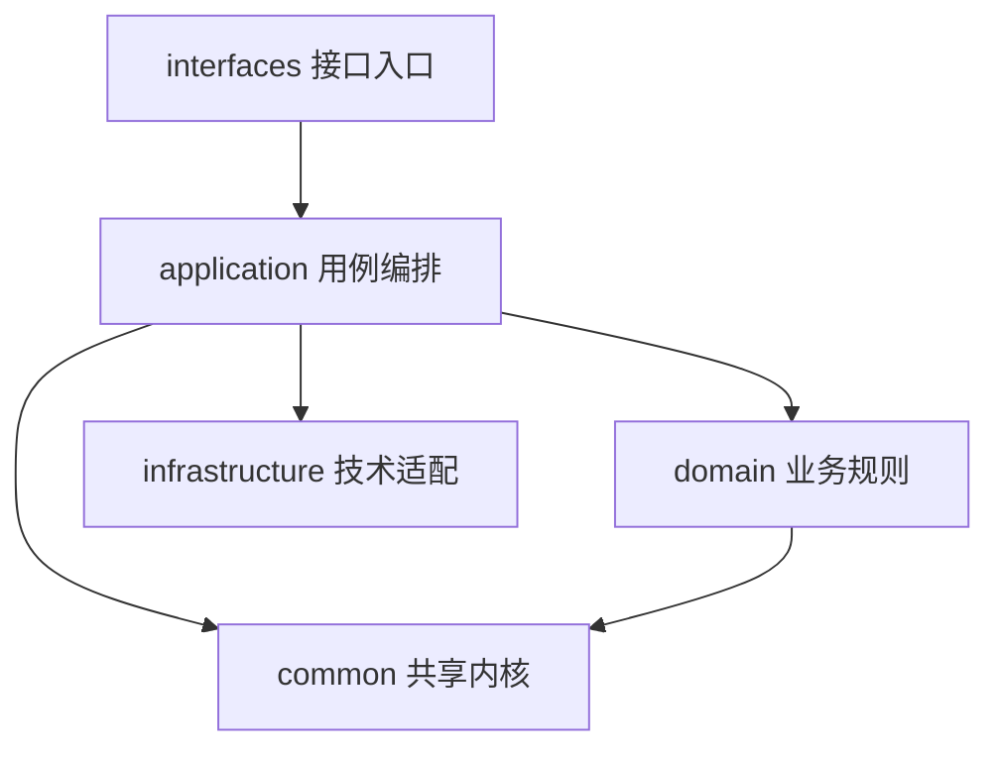
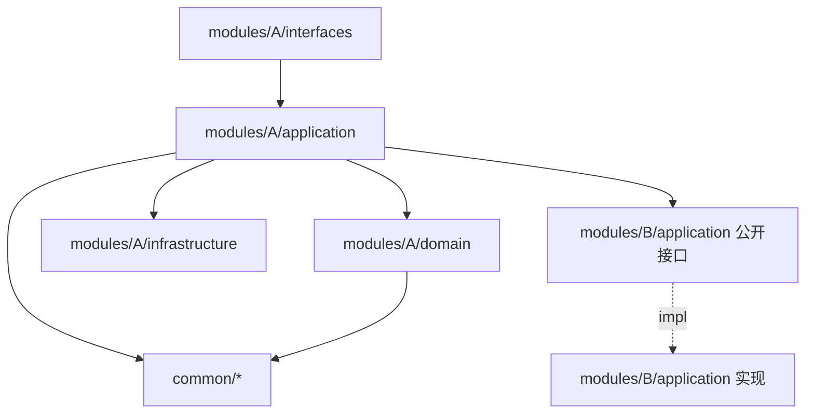
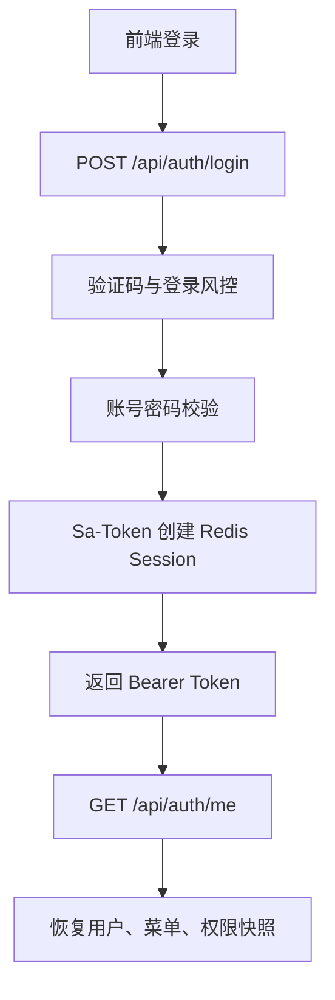
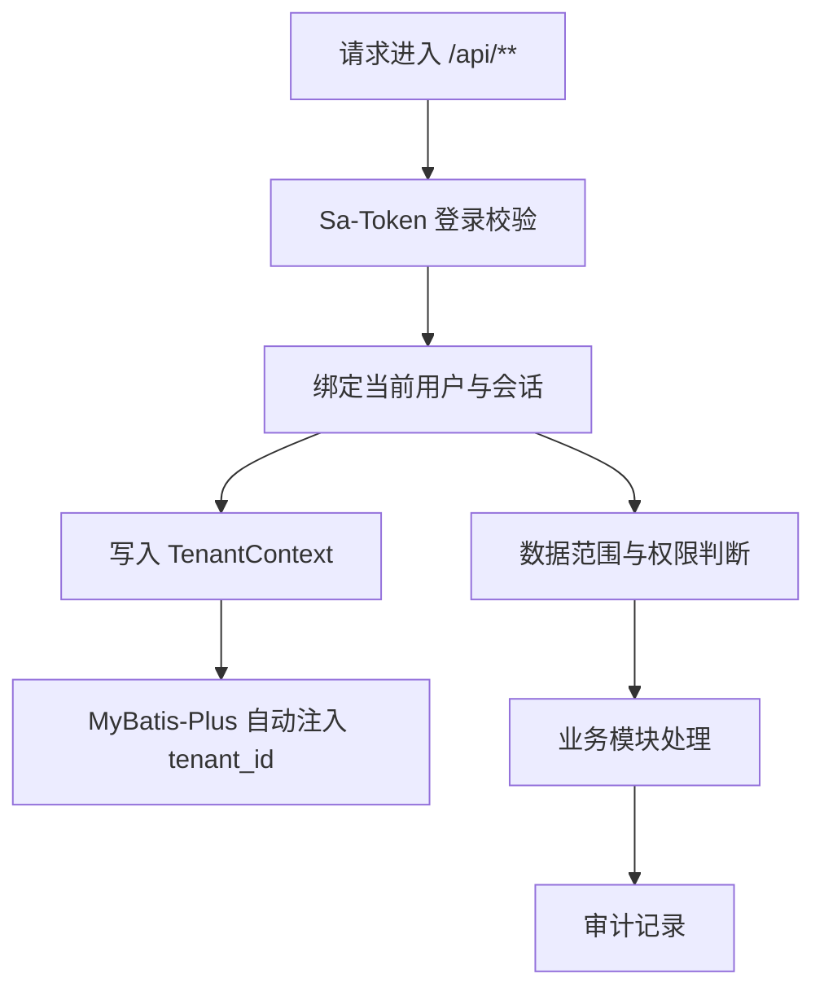
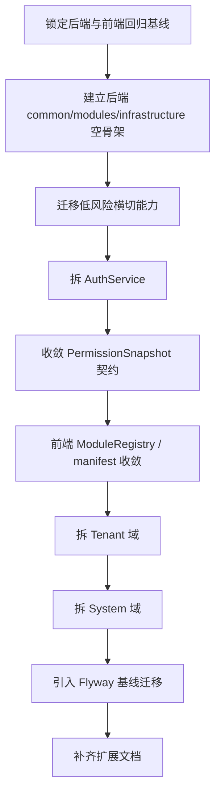

# 企业级权限管理平台基座改造计划清单

> 更新时间：2026-05-26（v3 修订：执行节奏、重构保险层与落地边界收敛）  
> 项目状态：未上线，可进行结构性重构  
> 目标定位：将 `enterprise-auth-platform` 改造成可复用、可扩展的企业后台项目基座

---

## 一、总体判断

当前项目已经具备企业后台基座的核心能力：

- Sa-Token Header Token 认证
- Redis Session
- RBAC 权限模型
- 多租户隔离
- 权限快照与动态菜单
- 审计日志与导出治理
- 用户、角色、部门、租户、系统管理基础模块
- 前端 Vue 3 + TypeScript + Element Plus 后台框架
- 后端测试、前端 E2E、CI 工作流基础

但当前结构仍偏传统大平层：

```text
controller / service / dao / dto / security / config
```

随着后续新项目复用和新功能扩展，这种结构会逐步出现以下问题：

- 大 Service 持续膨胀，业务边界不清晰
- 前端路由、菜单、权限、图标多处硬编码
- 数据库结构依赖完整 SQL 脚本，缺少版本化迁移
- 权限码、缓存、审计、数据范围等平台能力未完全沉淀为基座规范
- 新业务模块接入时容易改到核心认证、权限、布局和请求层

因此，最合适的路线不是立刻微服务化，也不是一次性完整 DDD，而是：


本计划替代旧版优化清单。旧版中的以下判断不再作为执行依据：

| 旧判断 | 当前结论 |
|---|---|
| Vite `^8.0.1` 属于 P0 异常 | 已过期，不作为紧急修复项；以实际构建验证为准 |
| 未见测试目录与用例 | 已过期；当前已有后端测试和前端 E2E，但测试分层仍需增强 |
| 直接引入 RocketMQ 做审计异步化 | 暂不优先；先封装审计事件接口，后续按需要接 MQ |
| 立即做完整 DDD / CQRS / Event Sourcing | 暂不做；当前优先级是模块边界和基座治理 |
| 直接微服务拆分 | 暂不做；先形成模块化单体，后续按模块自然拆分 |

---

## 二、基座改造原则

### 2.1 技术路线

| 方向 | 决策 |
|---|---|
| 后端架构 | 模块化单体，内部保留清晰模块边界 |
| 模块内部 | 采用 `interfaces / application / domain / infrastructure` 的轻量分层（**DDD 风格分层，不引入战术 DDD 模式**：不强制聚合根、值对象、领域事件总线、Repository 抽象层等） |
| 数据访问 | MyBatis-Plus 继续保留，逐步收敛 Mapper 使用边界 |
| 认证授权 | 保留 Sa-Token、Header Token、Redis Session、权限快照 |
| 多租户 | 保留 `TenantContext` + MyBatis-Plus 租户拦截 |
| 前端架构 | 模块注册式后台基座，统一路由、菜单、权限声明 |
| 数据库演进 | 引入 Flyway，完整 SQL 脚本转为基线迁移 |
| 微服务 | 暂不拆，等模块边界稳定后再评估 |

### 2.2 依赖方向



约束：

- `interfaces` 只处理入口、参数、响应，不写业务流程。
- `application` 编排用例，是业务流程入口。
- `domain` 放业务规则、策略、状态判断。
- `common` 只放跨模块共享能力，不放具体业务流程。
- `infrastructure` 放数据库、Redis、消息队列、第三方集成、Spring 配置。
- 技术适配器不能伪装成业务模块，例如 MQ 发布器应归入 `infrastructure/messaging`。

---

## 三、推荐后端目标结构

```text
src/main/java/com/enterprise/auth/platform/
├── EnterpriseAuthPlatformApplication.java
├── common/                   # 共享内核（被所有模块依赖，但不依赖任何模块）
│   ├── context/              # TenantContext、AuthContextHolder、RequestContext
│   ├── web/                  # ApiResponse、GlobalExceptionHandler、RateLimit、TenantFilter、通用 DTO
│   ├── authz/                # 授权与访问控制契约：DataScopeService、PlatformAdminSupport、权限码常量
│   ├── audit/                # 审计事件契约（接口 + 事件对象），不含落库实现
│   ├── cache/                # 缓存 key 命名、TTL 常量、失效契约
│   └── support/              # 时间、分页、字符串等少量稳定基础支持
├── modules/                  # 业务模块（按业务边界划分，模块内部自包含）
│   ├── auth/
│   │   ├── interfaces/       # AuthController、Captcha 入口、请求/响应对象
│   │   ├── application/      # LoginAppService、RegistrationAppService、SessionAppService、TenantSwitchAppService、PermissionSnapshotAppService
│   │   ├── domain/           # 认证策略、会话策略、登录风控规则、密码哈希策略
│   │   └── infrastructure/   # 本模块的 Entity / Mapper / Properties / 缓存适配
│   ├── user/                 # 用户目录、用户 CRUD、用户角色分配
│   ├── role/                 # 角色 CRUD、角色资源授权、数据范围配置
│   ├── resource/             # 菜单、按钮、资源树、权限码资源化
│   ├── dept/                 # 部门树、部门 CRUD、部门归属（独立模块）
│   ├── tenant/               # 租户生命周期、套餐能力、覆盖配置、变更日志
│   ├── system/               # 字典、参数、公告、分类规则
│   └── audit/                # 审计查询、审计导出、导出任务治理（消费 common/audit 事件）
└── infrastructure/           # 技术设施（不表达业务语义，只放与外部技术对接的代码）
    ├── persistence/          # MyBatis-Plus 全局配置、通用仓储基类、MetaObjectHandler
    │                         # ⚠️ 业务 Entity / Mapper 不在此处，跟随各自模块
    ├── redis/                # Redis、Redisson、Sa-Token Storage 配置
    ├── security/             # SaTokenPermissionProvider、SaTokenUserContextInterceptor 等技术胶水
    ├── messaging/            # 未来 MQ 适配（当前为空）
    ├── config/               # 纯技术配置：MybatisPlusConfig、WebMvcConfig、OpenApiConfig、CorsProperties
    │                         # ⚠️ 业务相关 Properties 跟随模块（如 RegistrationProperties → modules/auth）
    └── integration/          # 第三方系统适配
```

**Entity / Mapper / Properties 归属规则**（一次性定调，避免反复返工）：

| 归属位置 | 内容 | 例子 |
|---|---|---|
| `modules/{module}/infrastructure/` | 业务 Entity、Mapper、模块私有 Properties、模块私有缓存 | `SysUserEntity`、`SysUserMapper`、`RegistrationProperties`、`TenantProperties` |
| `infrastructure/persistence/` | MyBatis-Plus 全局配置、`MetaObjectHandler`、通用仓储基类、跨模块查询 | `MybatisPlusConfig`、`AuditMetaObjectHandler` |
| `infrastructure/config/` | 纯技术配置类 | `WebMvcConfig`、`CorsProperties`、`OpenApiConfig` |

**DTO 归属规则**：

| DTO 类型 | 归属位置 | 说明 |
|---|---|---|
| Controller 请求/响应对象 | `modules/{module}/interfaces/` | 只服务入口协议，不被其他模块直接依赖 |
| 应用服务输入/输出对象 | `modules/{module}/application/` | 用于模块内部用例编排或对外 facade 契约 |
| 领域对象 / 策略参数 | `modules/{module}/domain/` | 表达业务规则，不携带 Web 入参语义 |
| 跨模块通用请求对象 | `common/web` 或 `common/support` | 仅限 `PageQuery`、`IdRequest` 等真通用结构 |
| 跨模块只读视图 | 优先通过模块 facade 暴露 | 不轻易放入 `common`，避免共享模型膨胀 |

**配置项归属规则**：

| 配置项 | 归属建议 | 说明 |
|---|---|---|
| `CorsProperties`、`OpenApiConfig`、`WebMvcConfig` | `infrastructure/config` | 纯技术入口配置 |
| `RateLimitProperties` | `infrastructure/config` 或 `common/web` | 若只表达通用限流能力，不归属具体业务模块 |
| `SecurityProperties` | 拆分归属 | 会话/登录策略归 `modules/auth`，Sa-Token 技术适配归 `infrastructure/security` |
| `RegistrationProperties` | `modules/auth/infrastructure` | 注册策略是 auth 私有配置 |
| `TenantProperties` | 拆分归属 | 租户业务默认值归 `modules/tenant`，MyBatis 租户开关归 `infrastructure/persistence` |
| `AppCacheProperties` | `infrastructure/redis` 或 `common/cache` | Redis 技术连接归 infrastructure，key/TTL 契约归 common/cache |

**迁移节奏规则**：

- 第一轮允许新旧包并存，但必须明确迁移清单和删除时点。
- 不在阶段 1 一次性搬完所有 Entity / Mapper / Controller / DTO。
- Mapper 跟随对应 Service 拆分逐步迁移：先 Auth / Tenant / System，其他模块后续按需迁移。
- 每次移动包后必须确认 Spring 扫描、MyBatis Mapper 扫描、配置绑定和测试上下文仍然有效。
- 旧包只在新入口完全接管并通过回归后删除，不做“半迁移半删除”。

**`Sys*` 表名前缀**保留，不改名（成本高且无收益）；但 Java 类名命名第一轮**不强制改**，留作后续清理项。

### 3.1 `common` 边界

`common` 是**共享内核**，不是杂物间。判定标准：**被两个以上模块依赖，且不依赖任何业务模块**。

允许放入：

- `TenantContext`、`AuthContextHolder`、`RequestContext`
- `ApiResponse`、全局异常约定（`GlobalExceptionHandler`、`BusinessException`）
- 授权与访问控制契约（权限码常量、数据范围公共契约、平台管理员判断），统一放入 `common/authz`
- 审计事件契约（接口 + 事件对象，**不含落库实现**）
- 缓存 key / TTL 命名规范
- 时间、分页、字符串等少量稳定基础支持
- 通用 DTO（如 `PageQuery`、`IdRequest`，**仅限真跨模块复用**）

不允许放入：

- 用户创建、租户变更、角色授权等业务流程
- 某个模块私有 DTO / 枚举 / 工具类
- 未经归类的 `utils`
- Sa-Token 适配代码（属 `infrastructure/security`）
- 密码哈希、验证码、登录风控（属 `modules/auth`）

#### 当前 `security/` 包拆解参考

当前顶层 [security/](src/main/java/com/enterprise/auth/platform/security/) 混了三类语义，迁移时按下表归位：

| 文件 | 归属 |
|---|---|
| `TenantContext`、`AuthContextHolder`、`RequestContext` | `common/context/`（请求、租户、当前用户上下文） |
| `SecuritySupport`、`PlatformAdminSupport`、`DataScopeService` | `common/authz/`（授权与访问控制契约） |
| `PasswordHasher`、`PasswordHashConfig`、`AuthPrincipalCacheService`、`CurrentUserService` | `modules/auth/`（auth 私有能力） |
| `SaTokenPermissionProvider`、`SaTokenUserContextInterceptor` | `infrastructure/security/`（Sa-Token 技术胶水） |

> 避免继续扩大 `security` 语义：认证、授权、密码、Sa-Token 适配、当前用户上下文必须按上表拆开，不能再统一塞回一个 `security` 包。

### 3.2 `modules` 边界

推荐模块：

| 模块 | 职责 | 当前对应代码 |
|---|---|---|
| `auth` | 登录、注册、登出、会话治理、租户切换、权限快照协作、验证码、登录风控 | `AuthService`、`CaptchaService`、`LoginAttemptService`、`RegisterAttemptService`、`RegistrationPolicyService`、`PermissionSnapshotService` |
| `user` | 用户目录、用户 CRUD、用户角色分配、用户状态治理 | `UserManagementService`、`UserDirectoryService` |
| `role` | 角色 CRUD、角色资源授权、数据范围配置 | `RoleManagementService`、`RolePayloadCodec` |
| `resource` | 菜单、按钮、资源树、权限码资源化 | `ResourceService` |
| `dept` | 部门树、部门 CRUD、部门归属、部门数据范围 | `DeptManagementService` |
| `tenant` | 租户生命周期、套餐能力、覆盖配置、租户目录、变更日志 | `TenantManagementService`、`TenantCatalogManagementService`、`CatalogService` |
| `system` | 字典、参数、公告、分类规则 | `SystemManagementService` |
| `audit` | 审计查询、审计导出、导出任务治理 | `AuditService`、`AuditExportTaskService` |

> **关于 `dept` 是否独立**：当前已有独立的 `DeptController` / `DeptManagementService` / `SysDeptEntity` / 前端 `DepartmentsView`，且部门会同时被 user（部门归属）和 role（数据范围）依赖。**独立成模块**比合并入 user 更清晰，且改造成本相同。

每个模块内部尽量保持一致结构：

```text
modules/{module}/
├── interfaces/       # Controller、Request、Response
├── application/      # 用例服务、编排服务
├── domain/           # 领域规则、策略、领域对象
└── infrastructure/   # 本模块适配器、仓储实现、缓存实现
```

小模块可以先不强制建满四层，但语义边界必须保持。

### 3.3 `infrastructure` 边界

`infrastructure` 放**技术实现**，不表达业务语义，不被业务模块的领域层引用。

允许放入：

- MyBatis-Plus 全局配置、`MetaObjectHandler`、通用仓储基类
- Redis / Redisson 配置、Sa-Token Storage 配置
- Sa-Token 与业务的胶水代码（`SaTokenPermissionProvider`、`SaTokenUserContextInterceptor`）
- Flyway 配置
- MQ 适配器
- 第三方系统集成（短信、OSS、IDP）
- 纯技术 Spring 配置（`WebMvcConfig`、`OpenApiConfig`、`CorsProperties`）

不允许放入：

- **业务 Entity / Mapper**（跟随模块到 `modules/{module}/infrastructure/`）
- **业务 Properties**（`RegistrationProperties` → `modules/auth/`，`TenantProperties` → `modules/tenant/` 等）
- 业务规则、领域对象、用例编排

### 3.4 模块间协作规则

这是模块化单体的**核心约束**。不写清楚，未来按模块拆服务会非常痛。

#### 允许的依赖方向



#### 硬规则

| 规则 | 说明 |
|---|---|
| 模块对外**只暴露 application 层接口**（`xxxApplicationService` 或更细的 `xxxFacade`） | Controller、domain、infrastructure 对其他模块不可见 |
| 跨模块调用走 **Spring 注入接口**，不允许引用对方的 `domain` / `infrastructure` 包 | 通过 IDE/ArchUnit 守护 |
| `domain` 层**只依赖 common 与本模块**，不依赖任何其他业务模块 | 保证领域层可独立测试 |
| `infrastructure` 层**只依赖 common 与本模块 domain**，不跨模块 | 保证技术替换不污染业务 |
| 同步链路过深（A→B→C→D）应改为**事件解耦** | 例如审计：业务模块发布 `AuditEvent`，`modules/audit` 订阅落库 |
| 跨模块编排（如 `PermissionSnapshotApplicationService` 聚合 user/role/resource/tenant） | **必须放在编排方模块的 application 层**，依赖被聚合方暴露的 application 接口 |

#### 典型场景示例

| 场景 | 推荐做法 | 反例 |
|---|---|---|
| 登录后聚合菜单与权限码 | `auth.PermissionSnapshotAppService` 调用 `resource.ResourceQueryFacade`、`role.RoleQueryFacade` | 直接 `@Autowired SysResourceMapper` |
| 用户创建后发审计 | 业务发布 `common/audit` 定义的事件，`modules/audit` 异步/同步落库 | `UserManagementService` 直接调用 `AuditService.write()` |
| 删除部门时校验是否被用户引用 | `dept.DeptApplicationService` 调用 `user.UserQueryFacade.countByDept()` | 直接 `@Autowired SysUserMapper` |
| 租户切换刷新权限快照 | `auth.TenantSwitchAppService` 调用 `auth.PermissionSnapshotAppService` | Controller 自己拼装 |

---

## 四、必须保留的核心运行链路

后续重构必须保护以下链路：





不可破坏项：

- `Authorization: Bearer <token>` 主认证方式
- `X-Tenant-Id` 租户头语义
- Sa-Token Redis Session
- 权限快照返回菜单和权限码
- MyBatis-Plus 租户拦截
- 会话版本、强制下线、IP 绑定语义
- 审计记录语义

API 兼容清单：

| 契约 | 要求 |
|---|---|
| URL 与 Method | 第一轮不改 `/api/**` 路径和 HTTP Method |
| 请求字段 | 不删除、不改名现有字段；新增字段必须可选 |
| 响应字段 | 不改变现有前端依赖字段含义，尤其是 token、用户、菜单、权限快照 |
| 错误结构 | 保持当前 `ApiResponse` / 全局异常约定，不额外引入第二套错误格式 |
| 认证失败 | 401 语义稳定，前端可继续识别并跳转登录 |
| 授权失败 | 403 语义稳定，不混用 401 |
| Header | `Authorization` 与 `X-Tenant-Id` 继续作为主链路 Header |
| 分页和排序 | 当前列表页入参与响应结构保持兼容 |

---

## 五、分阶段实施路线图

### 阶段 0：重构保险层与基线锁定

优先级：P0  
建议周期：1-2 天

目标：在大改前锁定现状，把“能不能改”变成可执行、可回归、可阻断的质量门禁。

执行项：

| 序号 | 事项 | 范围 | 验收标准 |
|---|---|---|---|
| 0.1 | 修订优化计划清单 | `docs/优化计划清单.md` | 文档不再包含过期判断，且阶段边界、目录归属、迁移节奏明确 |
| 0.2 | 盘点现有测试并标记基线 | `src/test/java/.../platform/`、`frontend/e2e/` | 列出现有测试覆盖的认证、权限、租户、审计、CRUD 链路，缺口处补关键集成测试 |
| 0.3 | 锁定后端主链路回归 | Auth、User、Role、Resource、Tenant、Audit | 每条主链路至少有 1 个可执行测试，失败时阻断后续阶段 |
| 0.4 | 锁定前端 E2E 基线 | 登录、菜单、权限、关键 CRUD | E2E 可在本地和 CI 中稳定执行，作为前端路由/菜单改造保护网 |
| 0.5 | 固化 API 兼容清单 | `/api/**` | URL、Method、请求字段、响应字段、401/403、Header 语义保持兼容 |
| 0.6 | 明确第一轮改造边界 | 后端、前端、数据库 | 第一轮只做边界、Auth 拆分、前端 manifest 收敛和必要文档，不一次性重写所有业务 |
| 0.7 | 每阶段独立 PR + 标签 | Git | 形成 `phase-0`、`phase-1A`、`phase-1B` 等可回退点，阶段间不交叉提交 |

主链路最低回归矩阵：

| 链路 | 必须验证 |
|---|---|
| 登录 | 验证码、密码、租户、Sa-Token Session 创建、Bearer token 返回 |
| `/api/auth/me` | 用户信息、菜单树、权限码、租户上下文、权限快照结构 |
| 登出 / 强制下线 | token 失效、session 索引清理、前端 401 处理 |
| 租户切换 | 平台管理员允许、非管理员拒绝、权限快照刷新 |
| 用户 / 角色 / 资源 | 用户角色分配、角色资源授权、菜单恢复、权限判断 |
| 审计 | 同步写入、查询、导出任务创建、导出治理动作 |
| 多租户 | `X-Tenant-Id` 透传、MyBatis 租户过滤、全局表忽略 |

检查点：

```bash
mvn "-Dmaven.repo.local=.m2repo" test
cd frontend && npm run lint && npm run build
cd frontend && npm run test:e2e
```

---

### 阶段 1：后端模块化单体骨架

优先级：P0  
建议周期：3-5 天

目标：建立 `common / modules / infrastructure` 三类边界，为后续大 Service 拆分提供落点；阶段 1 不做大规模业务搬家。

#### 阶段 1A：只建边界，不搬业务

| 序号 | 事项 | 范围 | 验收标准 | 状态 |
|---|---|---|---|---|
| 1A.1 | 建立目标目录骨架 | `src/main/java/.../platform` | `common`、`modules`、`infrastructure` 目录存在，命名与计划一致 | ✅ 已完成 |
| 1A.2 | 建立八个业务模块空壳 | `modules/{auth,user,role,resource,dept,tenant,system,audit}` | 每个模块至少有 `interfaces/application/` 两层，domain/infrastructure 按需添加 | ✅ 已完成 |
| 1A.3 | 建立边界说明与迁移清单 | 当前大平层包 | 明确哪些旧包保留、哪些先迁、哪些后续随 Service 拆分迁移 | ✅ 已完成 |
| 1A.4 | 增加最小边界校验 | `src/test/java/.../arch/` | 至少校验模块不能引用其他模块的 `domain` / `infrastructure` | ✅ 已完成 |
| 1A.5 | 确认扫描范围 | Spring、MyBatis、配置绑定 | 包扫描、Mapper 扫描、配置绑定不因新目录出现而失效 | ✅ 已完成 |

#### 阶段 1B：只迁低风险横切能力

| 序号 | 事项 | 范围 | 验收标准 | 状态 |
|---|---|---|---|---|
| 1B.1 | 扁平化 `common/convention` | 当前 `common/convention/{annotation,exception,filter,result,web}` | 移除 `convention` 中间层，直接形成 `common/web`、`common/exception` 等稳定包 | ✅ 已完成：`common/convention` 已清空，Web/异常/限流/过滤器归位 |
| 1B.2 | 迁移共享上下文与 Web 约定 | `common/context`、`common/web`、`common/exception` | `TenantContext`、`RequestContext`、`ApiResponse`、`GlobalExceptionHandler`、`BusinessException` 归位 | ✅ 已完成：上下文、响应结构、业务异常、全局异常、限流、租户过滤已归位 |
| 1B.3 | 拆解现有 `security/` 包 | 按 3.1 节文件归属表 | 上下文、授权契约、auth 私有能力、Sa-Token 胶水分开，不再混入单个 security 包 | ✅ 已完成阶段 1B 范围：`AuthContextHolder` 归入 `common/context`，`DataScopeService`、`PlatformAdminSupport`、`SecuritySupport` 归入 `common/authz` |
| 1B.4 | 迁移纯技术配置 | `infrastructure/config`、`infrastructure/redis`、`infrastructure/persistence` | 只迁纯技术配置；业务 Properties 暂不全量搬迁 | ✅ 已完成：Web/OpenAPI/Async、Redis/Sa-Token Storage、MyBatis-Plus 归位；业务 Properties 保留 |
| 1B.5 | 暂缓业务大搬家 | Controller、Service、Entity、Mapper、DTO | 阶段 1 不全量迁移业务代码，等对应 Service 拆分时逐步迁移 | ✅ 已遵守 |
| 1B.6 | 保持 API 路径兼容 | Controller 层 | 包路径变化不影响 `/api/**` URL，前端无感切换 | ✅ 已遵守 |

检查点：

- 项目能启动。
- 现有测试能通过。
- 包结构变化不改变外部接口。
- 新旧包并存期间有明确迁移清单，不出现“无主代码”。

---

### 阶段 2：核心应用服务拆分

优先级：P0  
建议周期：**2-3 周（Auth → PermissionSnapshot → Tenant → System 串行，每个子项 3-5 天 + 回归验证 1-2 天）**

目标：拆掉当前最影响扩展性的核心大 Service，同时形成后续模块拆分模板。

**串行顺序原因**：

- `AuthService` 是入口链路，先拆能尽早暴露认证、会话、租户上下文契约问题。
- `PermissionSnapshotService` 连接 auth / role / resource / tenant，是前后端权限一致性的关键中介。
- 租户域与租户切换、资源覆盖、套餐能力耦合，必须在权限快照契约稳定后拆。
- `SystemManagementService` 子域明确，可作为系统类功能的拆分模板。

每个子项完成后**必须跑完阶段 0 锁定的回归链路**，通过后再开始下一个。

#### 2.1 `AuthService` 拆分

当前问题：登录、注册、登出、会话、租户切换等多个链路集中在一个服务内。

目标拆分：

| 目标服务 | 职责 | 状态 |
|---|---|---|
| `LoginApplicationService` | 登录认证、验证码校验、登录风控、Sa-Token 登录 | ✅ 已完成 |
| `RegistrationApplicationService` | 注册策略、注册防刷、注册审计 | ✅ 已完成 |
| `SessionApplicationService` | 登出、会话列表、强制下线、会话索引 | ✅ 已完成 |
| `TenantSwitchApplicationService` | 平台管理员租户切换、权限快照刷新 | ✅ 已完成 |

验收标准：

- 登录、登出、会话恢复、强制下线、租户切换行为不变。
- Controller 不再直接编排复杂业务链路。
- 单个应用服务只负责一个用例族。
- auth 内部可以继续临时调用旧 Service，但必须明确后续删除点。

#### 2.2 `PermissionSnapshotService` 契约收敛

目标拆分：

| 目标服务 | 职责 | 状态 |
|---|---|---|
| `PermissionSnapshotApplicationService` | 当前用户权限快照编排 | ✅ 已完成：`/api/auth/me` 与租户切换已切入应用层入口 |
| `ResourceQueryFacade` | 菜单、按钮、资源树只读查询契约 | ✅ 已完成：菜单树、权限码、授权键与菜单恢复口径已通过 resource facade 暴露 |
| `RoleGrantQueryFacade` | 角色授权、权限码只读查询契约 | ✅ 已完成：角色资源查询入口已切入只读 facade，并保留“角色不存在时报错”的旧语义 |
| `TenantResourcePolicyFacade` | 租户资源覆盖、可见性只读查询契约 | ✅ 已完成：租户资源覆盖查询已切入只读 facade，并纳入租户可见性策略 |

验收标准：

- `/api/auth/me` 返回结构不变。
- 前端菜单、权限指令、路由守卫行为不变。
- 权限快照不直接注入其他模块 Mapper。
- 后续前端 manifest 收敛有稳定 routeKey / grantKey / menu 契约可依赖。

当前验证：

- ✅ `mvn "-Dmaven.repo.local=.m2repo" test` 通过：102 tests, 0 failures, 0 errors。

#### 2.3 `TenantManagementService` 与租户目录拆分

租户域拆成三个子域，避免把套餐能力继续堆进一个新的大 Service。

| 子域 | 目标服务 | 职责 | 状态 |
|---|---|---|---|
| tenant lifecycle | `TenantLifecycleApplicationService` | 租户创建、更新、删除、状态治理、资源覆盖入口 | ✅ 已完成第一步：控制器已切入应用层入口，旧服务暂作兼容底座 |
| tenant catalog | `TenantCatalogApplicationService`、`TenantCapabilityApplicationService` | 套餐、能力、套餐能力关系、影响分析 | ✅ 已完成第一步：套餐与能力控制器已分别切入应用层入口 |
| tenant change log | `TenantChangeLogApplicationService` | 租户变更日志、历史摘要、影响说明 | ✅ 已完成：历史查询、摘要、写入与影响说明已集中到独立入口 |
| tenant access | `TenantAccessPolicy` | 租户可见性、平台管理员判断 | ✅ 已完成第一步：可见性与平台超级管理员判断已从旧服务抽成独立策略 |

验收标准：

- 租户列表、创建、更新、删除、能力覆盖、历史查询行为不变。
- `TenantManagementService`、`TenantCatalogManagementService`、`CatalogService` 的职责重新分配清晰。
- 变更日志逻辑集中，不散落在多个服务内。
- 套餐能力逻辑可被后续新项目复用。

当前验证：

- ✅ `mvn "-Dmaven.repo.local=.m2repo" test` 通过：102 tests, 0 failures, 0 errors。

#### 2.4 `SystemManagementService` 拆分

目标拆分：

| 目标服务 | 职责 | 缓存要求 | 状态 |
|---|---|---|---|
| `DictApplicationService` | 字典管理 | 明确字典查询缓存 key 与写后失效范围 | ✅ 已完成第六步：系统域回归测试已切换到系统模块自有视图模型，旧服务嵌套模型引用已清理 |
| `ConfigApplicationService` | 系统参数管理 | 明确参数缓存是否租户隔离、是否允许运行期刷新 | ✅ 已完成第五步：应用层无效二次映射已清理，直接消费系统模块自有视图模型 |
| `NoticeApplicationService` | 公告管理 | 明确公告是否缓存、按租户还是全局读取 | ✅ 已完成第五步：公告缓存口径已补齐，应用层无效二次映射已清理 |
| `CategoryRuleApplicationService` | 分类规则管理 | 明确分类规则被哪些页面/接口复用，变更后如何失效 | ✅ 已完成第五步：应用层无效二次映射已清理，分类规则模型与匹配能力归入系统模块 |

验收标准：

- 字典、参数、公告、分类规则接口行为不变。
- 缓存失效规则按子域独立管理。
- 新增系统子功能时不再继续堆进一个大服务。
- `SystemManagementService` 不再承担多个无关子域的统一入口职责。

---

### 阶段 3：数据库迁移与数据治理

优先级：P0  
建议周期：3-5 天

目标：把当前完整 SQL 脚本升级为可持续演进的数据库迁移体系，并消除“手工 SQL / CI 初始化 / 生产迁移”多路径并存的问题。

执行项：

| 序号 | 事项 | 范围 | 验收标准 | 状态 |
|---|---|---|---|---|
| 3.1 | 引入 Flyway | `pom.xml`、`src/main/resources/db/migration` | 新环境启动时可自动执行迁移 | ✅ 已完成第一步：已接入 Flyway 依赖与默认迁移目录 |
| 3.2 | 当前 SQL 转基线迁移 | `enterprise_auth_platform.sql` → `V1__baseline.sql` | 当前结构和基础数据能作为 V1 初始化 | ✅ 已完成：旧完整 SQL 已复制为 `V1__baseline.sql`，旧脚本暂保留作兼容备份 |
| 3.3 | 建立迁移命名规范 | `Vxxx__description.sql` | 后续结构、索引、种子数据都走版本化脚本 | ✅ 已明确：沿用 `V{yyyyMMddHHmm}__{module}_{description}.sql`，V1 基线不可修改 |
| 3.4 | 核验索引 | 用户、审计、租户、角色资源表 | 只根据实际查询路径补充索引，不盲目照旧计划添加 | ✅ 已完成第一轮：用户、角色资源、租户覆盖主路径索引已覆盖；新增审计查询组合索引迁移 `V202605280001__audit_query_indexes.sql` |
| 3.5 | 明确全局表与租户表 | MyBatis 租户拦截配置 | 全局表不被错误追加租户条件 | ✅ 已完成第一轮：`sys_tenant` 保持忽略；套餐/能力目录按 `platform` 租户承载，暂不扩大忽略表范围 |
| 3.6 | 同步 CI 初始化路径 | `.github/workflows/ci.yml` | CI 不再依赖手工导入旧 SQL，改为 Flyway 初始化或测试启动迁移 | ✅ 已完成第一步：已移除手工导入 SQL，测试启动触发 Flyway |
| 3.7 | 同步部署与启动文档 | `README.md`、`DEPLOYMENT_CHECKLIST.md` | 删除“手工执行完整 SQL”作为主路径，改为 Flyway 主路径 | ✅ 已完成第一轮：README 与部署检查清单已切换为 Flyway 主路径，并补充 baseline 说明 |

当前验证：

- ✅ `mvn "-Dmaven.repo.local=.m2repo" "-DskipTests" compile` 通过。
- ✅ `mvn "-Dmaven.repo.local=.m2repo" "-Dtest=com.enterprise.auth.platform.system.SystemManagementServiceTest" test` 通过：1 test, 0 failures, 0 errors。
- ✅ 已有本地库兼容验证通过：Flyway 创建 `flyway_schema_history`，将当前库 baseline 到版本 1，未重复执行 V1。
- ✅ 审计查询索引已按实际路径补齐：新增 `tenant_id + event_type + occurred_at + id`、`tenant_id + operator + occurred_at + id` 两组组合索引；Flyway 已成功迁移到 `202605280001 - audit query indexes`。
- ✅ 租户边界已核验：MyBatis 租户拦截只忽略 `sys_tenant`；套餐/能力目录数据以 `platform` 作为租户承载，依赖显式 `tenant_id='platform'` 查询，不作为忽略表处理。
- ✅ 部署与启动文档已切换为 Flyway 主路径：README 与 `DEPLOYMENT_CHECKLIST.md` 已移除“手工执行完整 SQL”主流程描述，并补充 baseline / 非空历史库迁移口径。

索引策略：

- 先基于实际查询和 Explain 核验。
- 保留当前”用户名全局唯一”设计，不改成租户内唯一，除非后续产品明确要求。
- 审计查询优先关注 `tenant_id + occurred_at`、`event_type + occurred_at`、`operator + occurred_at`。
- 租户资源覆盖、角色资源授权优先关注批量加载和授权保存路径。

Flyway 落地操作流程：

| 场景 | 操作 |
|---|---|
| 全新环境（CI、staging、prod 首次部署） | Flyway 自动跑 `V1__baseline.sql`（即当前 `enterprise_auth_platform.sql` 转换） |
| 开发同事本地**已经跑过老 SQL**、库非空 | 1. 备份本地库；2. 配置 `spring.flyway.baseline-on-migrate=true`、`baseline-version=1`；3. 启动应用，Flyway 写入 `flyway_schema_history` 表，将 V1 标记为已执行；4. 后续 V2+ 增量正常应用 |
| 历史 SQL 已被手工修改、与 V1 基线不一致 | 重建本地库（推荐）或手工 `flyway repair` 后核对差异，禁止改 V1 文件 |
| 已有 MyBatis-Plus DDL 自动生成或 `schema.sql` 初始化 | **关闭**，统一交给 Flyway |

新增脚本约定：

- `V{yyyyMMddHHmm}__{module}_{description}.sql`，例如 `V202606011030__tenant_add_status_index.sql`
- 不允许修改已 release 的 V 脚本，结构变更走新版本号。
- 大表 DDL 在脚本头注释中标注预估耗时与回滚方式。
- 基线脚本一旦被 CI / staging / prod 使用，即视为不可修改；后续修正走 V2+。

---

### 阶段 4：前端模块注册式基座

优先级：P1  
建议周期：1-2 周

目标：新增业务模块时，只注册模块清单，不再同时改路由、菜单、权限、图标、布局多处硬编码。

当前问题：

- 路由集中写在 `frontend/src/router/index.ts`。
- routeKey 与 path 映射在 `frontend/src/router/route-access.ts`。
- 菜单图标和标题映射在 `AppNav.vue`。
- `registerDynamicRoutes()` 目前不是实际动态注册。
- `auth` store 同时管理认证、租户、权限快照、持久化和租户切换。

目标结构：

```text
frontend/src/
├── app/                      # 基座骨架（与具体业务无关，启动时装配）
│   ├── registry/             # ModuleRegistry：聚合各模块清单，输出统一路由/菜单/权限
│   ├── router/               # 路由初始化、守卫、动态注册入口
│   ├── stores/               # 基座级 store（如全局 loading、错误）
│   └── http/                 # axios 实例、拦截器、错误码处理、请求取消、幂等重试
├── shared/                   # 跨模块复用资源
│   ├── components/           # 通用业务组件（CrudTable、SearchBar、DetailDrawer）
│   ├── composables/          # 通用组合式 API（useCrud、usePermission）
│   ├── permissions/          # 权限指令、权限码常量
│   └── utils/                # 时间、字符串、文件
└── modules/                  # 业务模块（每个模块自包含路由、菜单、状态、API、视图）
    ├── auth/                 # 登录、注册、找回密码、租户切换
    ├── platform/             # 用户、角色、资源、部门、租户（基座管理域）
    ├── system/               # 字典、参数、公告、分类
    ├── audit/                # 审计、在线用户
    └── dashboard/            # 首页与统计
```

> 注：`app/registry/` 取代旧稿的 `app/modules/`（旧命名与顶层 `modules/` 重复，已修正）。

模块清单形态：

```typescript
export interface ModuleManifest {
  name: string
  routes: RouteRecordRaw[]
  permissions: string[]
  nav?: ModuleNavItem[]
}
```

#### 阶段 4A：声明收敛，暂不强制动态路由

| 序号 | 事项 | 验收标准 |
|---|---|---|
| 4A.1 | 建立 `ModuleRegistry` | routeKey、path、component、title、icon、permission 从模块清单汇总 |
| 4A.2 | 迁移现有路由定义 | `router/index.ts` 不再单独维护完整业务路由映射 |
| 4A.3 | 迁移菜单图标和标题映射 | `AppNav.vue` 不再维护独立 `iconMap` / `titleMap` |
| 4A.4 | 收敛 routeKey/path 权限映射 | `route-access.ts` 消费统一 manifest，而不是另写一套映射 |
| 4A.5 | 保留静态路由注册 fallback | 权限、刷新、直达 URL 行为不变 |

#### 阶段 4B：真正动态路由与状态拆分

| 序号 | 事项 | 验收标准 |
|---|---|---|
| 4B.1 | 实现真正动态路由注册 | ✅ 已完成：`registerDynamicRoutes` 已按权限快照注入可访问业务路由，并支持重复注册前清理旧动态路由 |
| 4B.2 | 处理刷新与直达 URL 边界 | ✅ 已完成：会话恢复后按权限快照重新注册路由，深层地址首跳命中兜底时会触发原地址重匹配 |
| 4B.3 | 拆分认证状态 | ✅ 已完成第一轮：`auth` store 保持兼容门面，认证态、租户态、权限快照已拆到独立 store |
| 4B.4 | 增强 HTTP 请求治理 | ✅ 已完成第一轮：幂等请求默认可重试，写操作默认不重试，支持请求取消作用域和统一错误信息解析 |
| 4B.5 | 抽出通用 CRUD 组合能力 | ✅ 已完成第一轮：新增通用列表组合能力，覆盖列表、搜索、重置、分页、刷新、删除后回载状态模型 |

验收标准：

- 登录后菜单、权限指令、路由守卫行为不变。
- 前端 manifest 与后端 `routeKey` / `grantKey` / 权限快照契约一致。
- 新增业务页面只需要新增模块 manifest 和页面，不再多处同步硬编码。

---

### 阶段 5：平台能力沉淀

优先级：P1  
建议周期：1-2 周

目标：把缓存、权限、审计、配置从“功能实现”沉淀为“基座能力”。

#### 5.1 缓存体系

状态：✅ 已完成第一轮：新增 `common/cache` 缓存命名空间、key 构造入口和 TTL 策略入口；后续缓存接入必须从该契约扩展。

策略：

- 不从零重做，基于现有 Redis 缓存扩展。
- 先统一缓存命名、TTL、主动失效规则。
- 角色、菜单、字典、系统参数优先纳入缓存治理。
- 是否加入 Caffeine 一级缓存放到稳定后再评估。

验收标准：

- 缓存 key 有统一命名规范。
- 每类缓存有明确 TTL 和失效触发点。
- 权限、菜单、配置变更后不会出现长期脏数据。

#### 5.2 权限码治理

状态：✅ 已完成第一轮：后端新增 `PermissionCodes` 权限登记入口；前端新增 `permissions.ts` 权限声明入口，模块 manifest 已改为引用统一权限常量。

策略：

- 后端 Controller 注解不再直接写散落字符串。
- 前端权限判断引用统一权限声明。
- 数据库资源初始化、后端权限码、前端菜单权限形成一致映射。

验收标准：

- 新增权限码时有单一登记入口。
- 后端、前端、初始化数据不会出现拼写不一致。

#### 5.3 数据范围治理

状态：✅ 已完成第一轮：用户列表已从“全量查询后内存过滤”改为数据范围 SQL 条件下推，并使用数据库分页；补充了分页前应用数据范围的回归用例。

策略：

- 当前内存过滤先保留。
- 用户、部门、审计等高频查询逐步下推到 SQL 条件。
- 不引入 JPA Criteria，继续保持 MyBatis-Plus 技术路线。

验收标准：

- 大数据量列表不依赖先全量查出再内存过滤。
- 数据范围逻辑可以被新模块复用。

#### 5.4 审计事件治理

状态：✅ 已完成第一轮：新增审计事件发布契约 `common/audit/AuditEventPublisher`，当前 `AuditService` 继续同步落库，但业务侧已具备面向事件发布的统一入口。

策略：

- 短期保留同步写库。
- 抽象审计事件接口，业务模块只发布审计事件，不关心最终落库方式。
- 后续需要异步化时再接 MQ。

验收标准：

- 业务模块审计调用方式统一。
- 同步写库和未来异步写入可以平滑替换。

#### 5.5 环境配置治理

状态：✅ 已完成第一轮：补齐 `dev`、`staging`、`prod` 配置边界，新增本地配置示例模板，并同步 README 与部署检查清单。

策略：

- 补齐 `dev`、`staging`、`prod` 配置边界。
- 生产敏感信息继续使用环境变量或部署平台密钥。
- 本地开发配置保持不提交。

验收标准：

- 不同环境配置职责清晰。
- 默认配置不承担过多环境语义。

---

### 阶段 6：测试与 CI 质量门禁

状态：✅ 已完成第一轮：前端新增 Vitest 单元测试入口，覆盖权限快照 store 与通用 CRUD 组合能力；CI 已加入 `npm run test:unit`，继续保留后端 verify、前端 lint/build 与 E2E；本轮已复验 `npm run test:unit`、`npm run lint`、`npm run build` 与 `mvn "-Dmaven.repo.local=.m2repo" "-DskipTests" compile` 均通过。

优先级：P1  
建议周期：1 周

目标：让大改造可持续推进，不依赖人工手动验证。

测试分层：

| 层级 | 目标 | 工具 |
|---|---|---|
| L0 单元测试 | 业务规则、策略、工具支持 | JUnit 5 + Mockito |
| L1 Web/API 测试 | Controller 入参、响应、认证失败语义 | MockMvc / WebMvcTest |
| L2 集成测试 | 数据库、Redis、租户拦截、缓存 | Spring Boot Test |
| L3 前端单元/组件测试 | store、composable、权限指令 | Vitest |
| L4 E2E 测试 | 登录、权限、会话、关键 CRUD | Playwright |

CI 验收：

- 后端测试通过。
- 前端 lint 和 build 通过。
- E2E 核心流程通过。
- 代码覆盖率保持有效，不用全量 SpringBootTest 制造虚高覆盖。

---

### 阶段 7：基座文档与新项目复用指南

状态：✅ 已完成第一轮：README、部署检查清单、认证会话文档、基座扩展指南、模块边界规范、新项目初始化清单已形成闭环；本轮同步补齐 Vitest 单测门禁与 CI 质量门禁说明。

优先级：P2  
建议周期：2-3 天

目标：让后续新项目可以直接基于此基座扩展。

文档清单：

| 文档 | 内容 |
|---|---|
| `README.md` | 当前能力、启动方式、模块说明、扩展入口 |
| `DEPLOYMENT_CHECKLIST.md` | DB、Redis、Flyway、环境变量、CORS、健康检查 |
| `docs/security-auth.md` | 认证、会话、权限、租户切换、安全约束 |
| `docs/基座扩展指南.md` | 如何新增后端模块、前端模块、权限码、菜单、数据表、迁移脚本 |
| `docs/模块边界规范.md` | `common`、`modules`、`infrastructure` 的边界规则 |
| `docs/新项目初始化清单.md` | 项目名、应用名、数据库名、Redis key、租户默认值、主题定制 |

验收标准：

- 新增一个业务模块有标准步骤。
- 新项目初始化有清单可执行。
- 开发者不需要重新理解整套认证和权限链路即可扩展功能。

---

## 六、第一轮执行清单

第一轮只做“重构保险层 + 后端边界 + Auth 主链路拆分 + 前端 manifest 收敛”，不一次性重写所有业务。



| 顺序 | 任务 | 状态目标 | 状态 |
|---|---|---|---|
| 1 | 锁定后端主链路测试基线 | 登录、`/auth/me`、会话、租户、权限、审计、多租户链路可回归 | ✅ 已完成：`mvn "-Dmaven.repo.local=.m2repo" test` 通过，103 个用例 0 失败 |
| 2 | 锁定前端 E2E 基线 | 登录、菜单、权限守卫、关键 CRUD 能稳定跑通 | ✅ 已完成：`npm run test:e2e` 通过，14 个用例 0 失败，覆盖登录、菜单、租户切换、权限边界、会话管理、审计导出与视觉基线；本轮 `npm run build` 通过 |
| 3 | 建立后端八模块空骨架（含 `dept`） | 新旧代码可并存迁移，不搬大业务代码 | ✅ 已完成 |
| 4 | 增加最小模块边界校验 | 禁止跨模块引用对方 `domain` / `infrastructure` | ✅ 已完成 |
| 5 | 迁移低风险横切能力 | `common/context`、`common/web`、`common/authz`、`infrastructure/security` 等先归位 | ✅ 已完成 |
| 6 | 拆分 `AuthService` | 登录、注册、会话、租户切换独立，接口行为不变 | ✅ 已完成：Controller 已切到 auth application service；登录、注册、会话、租户切换均已独立；旧 `AuthService` 仅保留兼容转发；`AuthorizationBoundaryTest` 8 个用例通过 |
| 7 | 收敛 `PermissionSnapshotService` 契约 | `/auth/me` 菜单、权限码、routeKey、grantKey 稳定 | ✅ 已完成：`/api/auth/me` 已由 `PermissionSnapshotApplicationService` 输出统一快照；资源、角色授权、租户资源覆盖查询已通过 `ResourceQueryFacade`、`RoleGrantQueryFacade`、`TenantResourcePolicyFacade` 收敛为只读边界；Controller 对外 URL、Method、请求/响应字段、401/403 与 Header 语义保持兼容 |
| 8 | 建立前端 `app/registry/` 与模块 manifest | 路由、菜单、权限、图标、标题先统一声明，暂不强制动态注册 | ✅ 已完成：新增 `frontend/src/app/registry/module-manifest.ts`，路由定义与 `routeKey` 访问映射已统一从 manifest 派生；`router/index.ts` 已按权限快照真实注册动态路由，支持重复注册清理、刷新恢复、深层地址重匹配和登出清理；`npm run build` 通过 |
| 9 | 拆分租户域 | 租户生命周期、租户目录、变更日志、访问策略职责清晰 | ✅ 已完成第一轮：控制器已切入 tenant application service；租户目录查询已收敛到 `TenantDirectoryApplicationService`；套餐与能力目录已分别由 `TenantCatalogApplicationService`、`TenantCapabilityApplicationService` 承接；变更日志查询/摘要/写入已集中；访问策略已抽出；租户能力覆盖入口已从生命周期服务收敛到 `TenantCapabilityApplicationService`；旧 `TenantManagementService` 暂作兼容底座；`TenantControllerTest` + `TenantCatalogControllerTest` 共 6 个用例通过 |
| 10 | 拆分系统域 | 字典、参数、公告、分类规则独立，并明确缓存失效口径 | ✅ 已完成：控制器已切入 system application service；系统模块自有视图模型已收敛；缓存名称已归位到 `common/cache` 统一契约；字典、参数、公告、分类规则四个子域已分别由 `DictApplicationService`、`ConfigApplicationService`、`NoticeApplicationService`、`CategoryRuleApplicationService` 独立承接查询、分页、状态判定、分类/数据范围、审计分析与缓存失效；过渡端口与旧 `SystemManagementService` 已移除；系统域回归测试已切换到新应用服务 |
| 11 | 引入 Flyway 基线迁移 | DB 初始化进入版本化迁移，CI / README / 部署清单同步更新 | ✅ 已完成第一轮：Flyway 依赖、V1 基线、审计索引增量、CI、README、部署清单已同步；本地历史库 baseline 路径已验证 |
| 12 | 补齐扩展文档 | 新模块、新项目有明确接入方式 | ✅ 已完成：新增 `docs/基座扩展指南.md`、`docs/模块边界规范.md`、`docs/新项目初始化清单.md`，README 已补充扩展入口 |

第一轮不做：

- 不全量迁移所有 Entity / Mapper / DTO。
- 不立即删除所有旧包。
- 不继续拆认证态、会话态、租户态、权限快照状态。
- 不并行拆 `Auth`、`Tenant`、`System`。
- 不引入 MQ、微服务、微前端。

---

## 七、暂不做事项

| 事项 | 暂不做原因 |
|---|---|
| 微服务拆分 | 当前共享数据库、租户上下文、权限快照、审计仍在单体边界内，先拆会增加复杂度 |
| 完整 CQRS | 当前主要问题不是读写模型分离，而是模块边界和查询治理 |
| Event Sourcing | 当前审计日志和变更日志已能覆盖主要追溯需求，事件溯源对基座过重 |
| 全量 API 改 `/api/v1` | 可以预留版本策略，但第一轮不破坏现有路径 |
| 立刻引入 RocketMQ | 先封装审计事件接口，等确实需要异步化再接 MQ |
| 前端微前端 | 当前更需要模块注册和组件复用，微前端暂时过重 |

---

## 八、风险与缓解

| 风险 | 影响 | 缓解措施 |
|---|---|---|
| 阶段 0 保护网不足，后续重构无法判断是否破坏主链路 | 高 | 先锁定后端主链路测试和前端 E2E 基线，失败时阻断阶段 1+ |
| 大规模移动包导致回归 | 高 | 阶段 1 只建边界和迁低风险横切能力，不全量搬 Controller / Service / Entity / Mapper / DTO |
| 新旧包并存后出现“无主代码” | 高 | 每轮迁移必须有清单、接管入口和删除时点；旧包只在新入口通过回归后删除 |
| `common` / `infrastructure/config` 再次变成杂物间 | 高 | 通过模块边界规范限制；在 PR Review Checklist 中强制核对 DTO、Properties、Mapper 归属表 |
| `security` 语义继续混杂 | 高 | 按 `common/context`、`common/authz`、`modules/auth`、`infrastructure/security` 四类拆开，不再恢复单一大 security 包 |
| 模块间私下耦合（绕过 application 接口） | 高 | 引入 ArchUnit 规则在 CI 阶段校验；新增 Mapper 注入时优先 Review |
| `PermissionSnapshot` 契约不稳定导致前端改造返工 | 高 | 在拆 Tenant / System 前先收敛 `/auth/me`、routeKey、grantKey、菜单与权限码契约 |
| 阶段大改无法回滚 | 高 | **每阶段独立 PR + Git 标签（`phase-1A`/`phase-1B`/`phase-2.1` 等），保留可回退点；阶段间不交叉提交** |
| Flyway 基线迁移与现有库冲突 | 中 | 未上线项目优先以干净库验证；本地库走 `baseline-on-migrate=true` 流程，禁止改 V1 |
| Flyway 引入后初始化路径并存 | 中 | 同步修改 CI、README、部署清单，删除“手工导完整 SQL”作为主路径 |
| 串行拆分周期被压缩 | 中 | 优先级清晰：`Auth` 不通过不进 `PermissionSnapshot`，`PermissionSnapshot` 不稳不进 `Tenant` |
| 缓存引入脏数据 | 中 | 先定义失效策略，再扩大缓存范围；System 拆分时必须写清每个子域缓存口径 |
| 前端动态路由改造影响权限 | 中 | 先做 4A manifest 收敛，再做 4B 真动态注册；保留旧路由 fallback 一个迭代 |
| 测试执行时间变长 | 中 | 增加单元测试比例，减少全量 Spring 上下文测试依赖 |

---

## 九、阶段验收汇总

| 阶段 | 验收标准 |
|---|---|
| 阶段 0 | 文档准确，后端主链路与前端 E2E 形成可阻断的重构保险层 |
| 阶段 1A | 后端目录形成 `common / modules / infrastructure` 空骨架，模块边界校验开始生效 |
| 阶段 1B | 低风险横切能力归位，新旧包并存但迁移清单明确 |
| 阶段 2.1 | `AuthService` 完成登录、注册、会话、租户切换拆分，外部接口行为不变 |
| 阶段 2.2 | `PermissionSnapshot` 契约稳定，`/auth/me`、routeKey、grantKey、菜单与权限码可支撑前端改造 |
| 阶段 2.3 | 租户生命周期、租户目录、变更日志、访问策略职责清晰 |
| 阶段 2.4 | 系统字典、参数、公告、分类拆分完成，缓存失效口径明确 |
| 阶段 3 | Flyway 可完成干净库初始化，CI、README、部署清单统一到迁移主路径 |
| 阶段 4A | 前端路由、菜单、权限、图标、标题由模块 manifest 统一声明 |
| 阶段 4B | 动态路由注册真实生效，认证态、会话态、租户态、权限快照职责分离 |
| 阶段 5 | 缓存、权限、审计、配置形成可复用平台能力 |
| 阶段 6 | 测试分层和 CI 能保护主链路 |
| 阶段 7 | 新模块、新项目扩展有文档可依赖 |

---

## 十、最终目标

完成本计划后，项目应具备以下基座能力：

- 新业务按模块接入，不污染认证、权限、布局核心代码。
- 后端模块边界清晰，未来需要时可按模块拆服务。
- 前端路由、菜单、权限通过模块清单统一维护。
- 数据库结构通过 Flyway 持续演进。
- 权限码、缓存、审计、数据范围成为平台能力。
- 新项目可通过文档和初始化清单快速复用该基座。