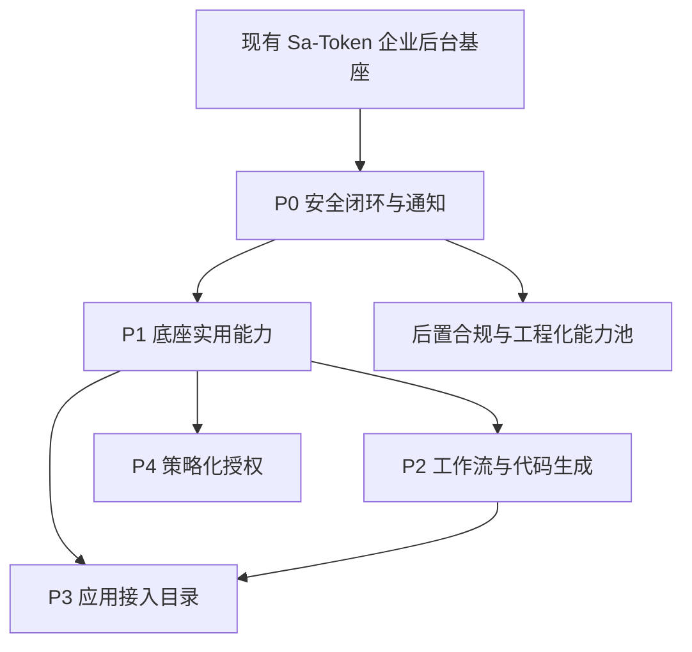
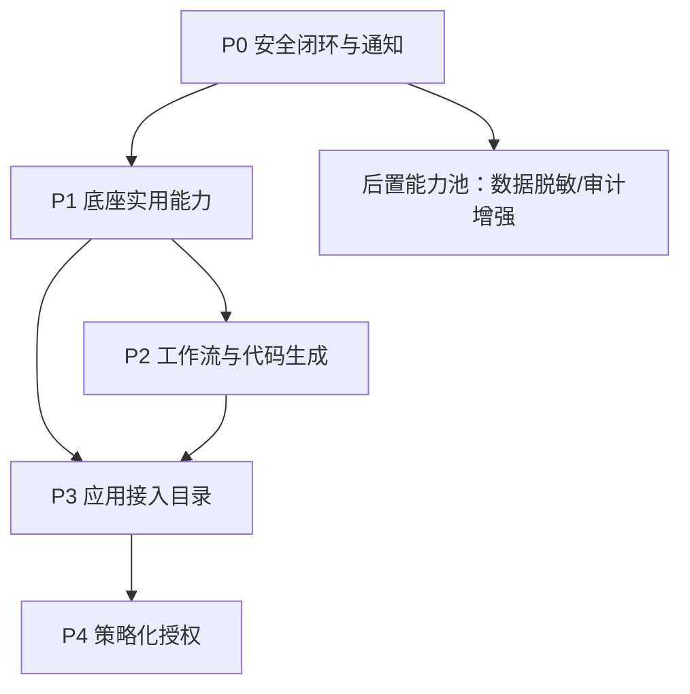

# 企业级权限管理平台 — IAM 功能拓展计划

## 1. 背景与当前基座定位

当前项目是一套基于 Spring Boot 3、Sa-Token、MyBatis-Plus、MySQL、Redis、Vue 3 的企业认证权限基座，定位为**可复用底座**：日后做新项目时可以直接拿起来用，不用再从头写登录注册和权限系统，同时具备主流开源后台项目的基础功能。

当前已具备：

- 账号密码登录、滑块验证码、登录失败限制。
- Redis Session、Bearer Token、在线会话、强制下线。
- RBAC、菜单资源、权限快照、动态路由。
- 多租户隔离、租户上下文、租户套餐与能力覆盖。
- 用户、角色、部门、资源、字典、参数、公告、分类规则。
- 审计事件查询、导出任务、归档、清理、重试。

当前核心目标是补齐生产安全闭环、账号自助、基础通知、应用接入目录，再按需扩展策略化授权。

关键约束：

- 主认证链路继续基于 Sa-Token Header Token。
- 浏览器不重新引入自建 access token / refresh token 双令牌模型。
- 业务模块继续遵守模块化单体边界：`interfaces -> application -> domain`，数据库和适配放在模块内 `infrastructure`。
- 新权限码继续统一登记，避免后端、前端、菜单初始化数据各写一套。
- Flyway 只新增版本脚本，不修改历史基线脚本。

---

## 2. 主流开源 IAM 能力对照

| 项目 | 定位 | 借鉴能力 | 当前项目应采用的方式 |
|---|---|---|---|
| Keycloak | 企业 IAM / SSO 标准实现 | SSO、身份代理、用户联邦、账号控制台 | 借鉴账号自助、安全策略中心，不短期照搬完整协议服务器 |
| Casdoor | UI 优先的 IAM / SSO 平台 | 应用管理、组织、外部身份、SCIM | 借鉴应用目录、身份提供商、账号绑定 |
| Authentik | 自托管身份提供商（次要参考） | 认证流程编排、条件策略 | 借鉴条件授权、登录 Stage/Flow 拆分思路 |
| Authelia | 认证门户与访问控制（次要参考） | SSO 门户、访问策略 | 借鉴集中门户和访问策略 |
| RuoYi-Vue-Plus | 国内企业后台框架 | 数据脱敏、通知、代码生成、工作流 | 仅吸收安全与工程化能力，后置非 IAM 主线能力 |
| SmartAdmin | 企业后台安全增强 | 密码策略、登录锁定、数据脱敏 | 借鉴安全策略中心和合规能力 |
| Logto | 现代 IAM / CIAM | 应用、组织、Webhook、审计 UI | 借鉴应用接入、组织权限、事件通知 |

---

## 3. 当前项目能力缺口矩阵

| 能力 | 当前状态 | 缺口说明 | 优先级 | 是否第一批 |
|---|---|---|---|---|
| 密码策略 | 部分具备 | 缺租户级复杂度、历史、过期、强制修改 | P0 | 是 |
| 忘记密码 / 重置密码 | 缺失 | 缺一次性令牌、频控、重置后会话失效 | P0 | 是 |
| 账号自助中心 | 缺失 | 缺个人资料编辑、改密统一入口 | P0 | 是 |
| 登录安全策略 | 部分具备 | 缺租户级策略面板（当前硬编码在 LoginAttemptService） | P0 | 是 |
| 邮件通知基础设施 | 缺失 | 当前 messaging 为空包，无任何通知通道 | P0 | 是 |
| 用户头像上传 | 缺失 | 缺文件上传与头像裁剪，作为底座常见需求 | P1 | 是 |
| 操作日志 | 缺失 | 当前只有安全审计事件，缺少结构化的业务操作日志查询 | P1 | 是 |
| 仪表盘统计 | 缺失 | 缺首页运行总览的统计数据接口 | P1 | 是 |
| 数据导出通用能力 | 部分具备 | 审计导出已有，但缺通用 Excel/CSV 导出抽象 | P1 | 是 |
| 文件管理 | 缺失 | 缺统一文件上传、存储、访问的基础设施 | P1 | 是 |
| 应用接入目录 | 缺失 | 缺应用、密钥、授权、门户 | P3 | 否 |
| 应用门户 | 缺失 | 用户无法看到自己可访问的业务系统 | P3 | 否 |
| 策略化授权 | 缺失 | 当前以 RBAC + 数据范围为主，缺条件授权和预演 | P4 | 否 |
| 数据脱敏 | 缺失 | 缺统一响应脱敏与字段级策略 | 后置增强 | 否 |
| 工作流 | 缺失 | 缺审批流、转签、催办等流程引擎 | P2 | 否 |
| 代码生成器 | 缺失 | 缺根据表结构自动生成 CRUD 前后端代码的能力 | P2 | 否 |
| API 加解密 | 缺失 | HTTPS 已覆盖传输加密，应用层加解密按需实现 | 后置增强 | 否 |
| i18n | 缺失 | 国际化体验增强，非底座前置条件 | 后置增强 | 否 |

---

## 4. 分阶段路线图



阶段定义：

| 阶段 | 核心目标 | 交付形态 |
|---|---|---|
| P0 安全闭环与通知 | 让现有登录、账号、会话达到生产安全基线，建立通知基础设施 | 安全策略中心、密码策略、重置密码、账号自助、邮件通知 |
| P1 底座实用能力 | 补齐作为可复用底座的常见基础功能 | 用户头像/文件上传、操作日志、仪表盘统计、通用导出、文件管理 |
| P2 工作流与代码生成 | 让底座具备流程审批和开发提效能力 | 工作流引擎、流程设计器、代码生成器 |
| P3 应用接入目录 | 建立后续 SSO / 应用授权的基础模型 | 应用管理、密钥轮换、应用授权、应用门户 |
| P4 策略化授权 | 从纯 RBAC 演进为可解释的条件授权 | 条件策略、策略预演、影响分析 |

第一批建议做 P0 + P1，先让底座能"拿来就用"。预估工期：

| 阶段 | 预估工期 | 累计 |
|------|---------|------|
| P0 安全闭环与通知 | 2-3 周 | 2-3 周 |
| P1 底座实用能力 | 3-4 周 | 5-7 周 |
| P2 工作流与代码生成 | 先 PoC 1 周，MVP 3-4 周 | 9-12 周 |
| P3 应用接入目录 | 2-3 周 | 11-15 周 |
| P4 策略化授权 | 3-4 周 | 14-19 周 |

---

## 5. 第一阶段详细落地包：P0 + P1

### 5.1 P0：安全闭环与通知

目标：在不改变当前 Sa-Token 主链路的前提下，补齐企业后台认证安全底座和通知基础设施。

P0 拆成三个可验收子阶段，避免一次性改动认证主链路、通知、数据库和前端页面：

| 子阶段 | 目标 | 核心交付 |
|---|---|---|
| P0-A | 安全策略基础 | 安全策略表、平台默认值、租户覆盖、策略合并、密码校验参数化 |
| P0-B | 登录与会话闭环 | 强制改密、密码过期、受限改密会话、复用 `session_version` 使旧会话失效 |
| P0-C | 重置密码与通知 | 重置 token、邮件通知、公开接口频控、防账号枚举、安全审计 |

范围：

- 租户级安全策略（密码复杂度、历史、过期、锁定参数）。
- 密码历史、密码过期、首次登录强制修改。
- 登录失败锁定策略参数化（从硬编码改为读安全策略）。
- 忘记密码、重置密码、重置后强制下线。
- 我的账号（个人资料、改密）。
- 邮件通知基础设施。
- 登录与账号安全审计。

不做：

- 不改为 Cookie Session 主链路。
- 不一次性接入短信供应商。

P0 阶段必须补齐的通知最小闭环：

由于当前代码中 `infrastructure/messaging/` 仅为空包，零通知通道。重置密码流程无法发验证码或重置链接，P0 安全闭环中必须包含一个最小通知通道：

```java
public interface NotificationChannel {
    void sendVerificationCode(String target, String code, int ttlMinutes);
    void sendPasswordResetLink(String target, String resetUrl, int ttlMinutes);
}
```

两个实现：

| 实现 | 用途 | 环境 |
|------|------|------|
| `LogNotificationChannel` | 控制台打印验证码和链接 | dev / local |
| `SmtpNotificationChannel` | SMTP 发送邮件 | staging / prod |

短信通道后置到后置能力池，不在 P0 引入。P0 的重置密码环节仅依赖邮件通道完成闭环。

生产环境禁止将 `LogNotificationChannel` 作为 SMTP fallback。`LogNotificationChannel` 仅允许 dev/local 使用；staging/prod 中 SMTP 失败必须失败关闭，记录审计和告警，不把验证码或重置链接写入日志。

#### P0 重置密码频控策略

`POST /api/auth/password/reset/request` 为公开接口，需按以下维度限流以防止恶意请求：

| 维度 | Redis Key | 阈值 | TTL |
|------|-----------|------|-----|
| 按用户名 | `pwd:reset:rate:user:{tenantId}:{username}` | 5 次/小时 | 1 小时 |
| 按 IP | `pwd:reset:rate:ip:{ip}` | 3 次/小时 | 1 小时 |

超过阈值返回 429，不生成令牌，不发送通知。频控 Key 的 TTL 与阈值时间窗口一致，避免无限累积。通过频控并进入处理流程的请求即计入一次 accepted reset request；SMTP 发送失败不应绕过频控。

公开接口必须避免账号枚举：无论账号是否存在，`request` 接口均返回统一提示：`如果账号存在，系统将发送重置邮件`。后端内部只在账号存在且邮箱可用时生成 token 和发送邮件。

`tenantId` 必须有明确来源：优先使用请求体中的 `tenantId`；未传时按租户域名或当前租户上下文解析；仍无法解析时回退默认租户。若用户名在多个租户下存在，必须要求用户显式选择租户，不能猜测。

#### P0 邮件模板管理

P0 阶段邮件模板以代码常量形式存放，后续可演进为数据库存储或外部模板服务。

- 模板位置：`infrastructure/messaging/template/` 包下，每个模板一个类（如 `PasswordResetTemplate`）
- 模板变量：`{resetUrl}`、`{ttlMinutes}`、`{username}` 等，通过简单占位符替换
- 邮件标题格式：`[系统名称] 密码重置`
- 支持纯文本邮件，暂不引入 HTML 模板引擎

#### P0 数据模型草案

安全策略采用**平台默认值 + 租户覆盖**两级模型：新建租户自动继承平台基线，租户可按需覆盖。避免每新增一个租户都要手动配置全套策略。

| 表 | 作用 | 关键字段 |
|---|---|---|
| `sys_platform_security_policy` | 平台默认安全策略 | `password_min_length`、`password_require_uppercase`、`password_require_number`、`password_require_symbol`、`password_expire_days`、`password_history_count`、`login_fail_threshold`、`login_lock_minutes`、`captcha_enabled` |
| `sys_tenant_security_policy` | 租户级安全策略覆盖 | `tenant_id`（唯一）、以及可覆盖的字段同上表，值为 NULL 时继承平台默认值 |
| `sys_password_history` | 密码历史 | `tenant_id`、`user_id`、`password_hash`、`changed_at` |
| `sys_password_reset_token` | 重置密码令牌 | `tenant_id`、`user_id`、`token_hash`、`channel`（`EMAIL`/`SMS`）、`expires_at`、`used_at`、`revoked_at`、`request_ip`、`used_ip`、`request_id`、`user_agent`、`created_at` |

> 当前 `sys_user` 已有 `session_version` 与 `password_updated_at`。P0 不新增 `password_version`，密码修改、密码重置、管理员重置密码后统一自增现有 `session_version`，复用当前会话版本失效机制。`password_expired` 不落库，按 `password_updated_at + password_expire_days` 动态计算。`sys_user` 仅新增 `must_change_password`；P1 再新增 `avatar_file_key`。

平台默认安全策略使用单例记录，建议固定 `policy_code = 'DEFAULT'` 并在 Flyway 中初始化。租户覆盖表可以没有记录；查询生效策略时按 `tenantValue ?? platformValue` 合并。

#### P0 重置密码令牌生命周期

| 状态 | 触发条件 | 行为 |
|------|----------|------|
| 生成 | 用户请求重置密码且通过频控 | 生成随机 token，SHA-256 哈希存 `token_hash`，原文通过邮件发送，有效期默认 15 分钟 |
| 新 token 生成后 | 同一用户存在未使用且未过期旧 token | 标记旧 token 的 `revoked_at`，保证同一用户同一时间只有最新 token 有效 |
| 校验中 | `/verify` 接口校验 token | 只返回 token 是否有效，不标记 `used_at`，不修改密码 |
| 未使用且未过期 | `expires_at > NOW() AND used_at IS NULL AND revoked_at IS NULL` | 可调用 `confirm` 接口完成重置 |
| 使用后 | `confirm` 接口校验通过 | `used_at`、`used_ip` 标记当前请求，用户 `session_version` 自增，旧会话失效 |
| 过期 | `expires_at <= NOW()` | 令牌失效，需重新发起重置请求。定时任务每天凌晨清理过期且未使用的令牌 |
| 重复提交 | `used_at IS NOT NULL` 或 `revoked_at IS NOT NULL` | 拒绝并记录审计事件 `PASSWORD_RESET_FAILED` |

令牌原文在后端只在生成时持有一次，发给邮件后即丢弃，不入库、不入日志。

#### P0 API 草案

| 接口 | 说明 | 权限 |
|---|---|---|
| `GET /api/security/policy` | 查询当前生效的安全策略（合并平台默认值+租户覆盖） | `security:read` |
| `PUT /api/security/policy` | 更新当前租户安全策略覆盖 | `security:write` |
| `GET /api/security/policy/platform` | 查询平台默认安全策略 | 平台超级管理员 + `security:read` |
| `PUT /api/security/policy/platform` | 更新平台默认安全策略 | 平台超级管理员 + `security:write` |
| `POST /api/security/unlock-account` | 管理员手动解锁被锁定的账号 | `security:write` |
| `GET /api/account/profile` | 我的资料 | 登录即可 |
| `PUT /api/account/profile` | 更新我的资料 | 登录即可 |
| `POST /api/account/password/change` | 修改自己的密码 | 登录即可；强制改密场景允许受限改密会话访问 |
| `POST /api/auth/password/reset/request` | 发起忘记密码 | 公开接口 + 频控 |
| `POST /api/auth/password/reset/verify` | 校验重置令牌是否有效 | 公开接口 + 令牌校验 |
| `POST /api/auth/password/reset/confirm` | 确认重置密码 | 公开接口 + 令牌校验 |

#### P0 前端入口

| 页面 | 路径建议 | 说明 |
|---|---|---|
| 安全策略中心 | `/system/security-policy` | 管理租户级安全规则 |
| 我的账号 | `/account/profile` | 个人资料与改密 |
| 重置密码 | `/reset-password` | 公开页面，承接邮件链接 |

#### P0 权限码

| 权限码 | 名称 | 用途 |
|---|---|---|
| `security:read` | 安全策略查看 | 查看租户级安全策略 |
| `security:write` | 安全策略管理 | 修改租户级安全策略、解锁账号 |

账号自助类接口使用 `@SaCheckLogin`，不做权限码校验。强制改密场景下，改密接口允许受限改密会话访问，但该会话不能访问其他账号自助或业务接口。`account:read/write` 预留给管理员代管和菜单可见性控制，不在 P0 强制使用。

#### P0 审计事件

| 事件 | 触发时机 |
|---|---|
| `PLATFORM_SECURITY_POLICY_UPDATED` | 平台安全策略变更 |
| `TENANT_SECURITY_POLICY_UPDATED` | 租户安全策略变更 |
| `PASSWORD_CHANGED` | 用户主动改密 |
| `PASSWORD_RESET_REQUESTED` | 发起忘记密码 |
| `PASSWORD_RESET_COMPLETED` | 重置密码成功 |
| `PASSWORD_RESET_FAILED` | 重置密码令牌无效或过期 |
| `PASSWORD_EXPIRED_BLOCKED` | 密码过期阻断登录 |
| `ACCOUNT_LOCKED` | 登录失败达到锁定阈值，账号被锁定 |
| `LOGIN_BLOCKED` | 被锁定账号再次尝试登录 |
| `FORCE_UNLOCK` | 管理员手动解锁被锁定的账号 |

> 已有事件 `LOGIN_FAILED`、`LOGIN_BLOCKED`、`ACCOUNT_LOCKED`、`LOGIN_SUCCESS`、`LOGOUT`、`SECURITY_ACCESS_DENIED`、`REGISTER_RATE_LIMITED` 保持不变。P0 不新增 `LOGIN_LOCKED`，避免与 `ACCOUNT_LOCKED` 语义重叠。

#### P0 验收点

- 密码过期用户不能直接进入后台，必须进入受限改密态完成改密。
- 强制改密或密码过期时，只允许访问改密页面和改密接口，不能访问其他业务接口。
- 重置密码成功后，该用户旧会话失效（通过现有 `session_version` 自增与会话比对实现）。
- 租户级安全策略变更记录审计事件 `TENANT_SECURITY_POLICY_UPDATED`，载荷包含变更前后字段摘要。
- 新建租户自动继承平台安全基线，无需手动配置。
- `PasswordValidator` 从硬编码正则改为读取租户级安全策略参数。
- `LoginAttemptService` 从硬编码阈值改为读取安全策略参数。
- 管理员可以手动解锁被锁定的账号，记录审计事件 `FORCE_UNLOCK`。

### 5.2 P1：底座实用能力

目标：补齐作为可复用底座在日常项目中的常见基础功能，让这个底座拿起来就能用。

范围：

- 用户头像上传与裁剪。
- 统一文件上传、存储、访问基础设施（本地存储 + MinIO/S3 抽象）。
- 操作日志（结构化的业务操作记录，区别于安全审计事件）。
- 仪表盘统计（用户总数、在线数、租户数、今日登录等首页数据）。
- 通用数据导出抽象（基于已有审计导出能力，提取为公共基础设施）。

不做：

- 不做 WebAssembly 前端框架。

#### P1 数据模型草案

| 表 | 作用 | 关键字段 |
|---|---|---|
| `sys_storage_file` | 文件存储记录 | `tenant_id`、`file_key`、`original_name`、`content_type`、`file_size`、`storage_type`、`bucket`、`visibility`、`business_type`、`business_id`、`owner_id`、`uploader_id`、`created_at` |
| `sys_operation_log` | 操作日志 | `tenant_id`、`operator`、`module`、`action`、`target_type`、`target_id`、`detail_json`、`client_ip`、`request_id`、`occurred_at` |

> 用户头像通过 `sys_user` 表新增 `avatar_file_key` 字段关联 `sys_storage_file`。

#### P1 API 草案

| 接口 | 说明 | 权限 |
|---|---|---|
| `POST /api/files/upload` | 上传文件 | 登录即可 |
| `GET /api/files/{fileKey}` | 获取文件 | 按文件 `visibility` 与业务授权判断 |
| `DELETE /api/files/{fileKey}` | 删除文件 | 文件所有者或 `file:write` |
| `PUT /api/account/profile/avatar` | 上传/更新我的头像 | 登录即可 |
| `GET /api/dashboard/stats` | 仪表盘统计数据 | `dashboard:read` |
| `GET /api/operation-logs` | 操作日志查询 | `operation-log:read` |
| `GET /api/operation-logs/export` | 导出操作日志 | `operation-log:export` |

#### P1 文件访问模型

文件访问不能只依赖 `fileKey`。`sys_storage_file.visibility` 定义最小访问边界：

| 可见性 | 说明 |
|---|---|
| `PUBLIC` | 头像、应用图标等可公开访问的文件 |
| `TENANT` | 同租户登录用户可访问 |
| `OWNER` | 仅上传者或所有者可访问 |
| `PRIVATE` | 必须通过具体业务授权访问，如导出结果、工作流附件 |

上传文件名只作为展示名，不参与实际存储路径。后端不信任前端传入的 `contentType`，需做真实类型校验；本地存储目录不得放在 Web 静态目录下。

#### P1 仪表盘统计范围

`GET /api/dashboard/stats` 按当前用户身份返回不同范围：

| 用户类型 | 统计范围 |
|---|---|
| 平台超级管理员 | 全平台统计 |
| 租户管理员 | 当前租户统计 |
| 普通用户 | 可见范围内的基础统计，或不开放敏感统计 |

租户数、全平台用户总数等平台级指标不得向普通租户用户暴露。

#### P1 操作日志采集方式

操作日志优先记录有状态变化的业务动作，不默认记录所有查询接口：

| 采集方式 | 适用场景 |
|---|---|
| 注解式采集 | 用户、角色、资源、租户等标准 CRUD |
| 显式发布事件 | 授权、审批、密钥轮换等复杂业务动作 |
| 自动记录所有接口 | 不建议，噪声大且容易记录敏感数据 |

#### P1 前端入口

| 页面 | 路径建议 | 说明 |
|---|---|---|
| 运行总览（增强） | `/dashboard` | 首页统计数据卡片 |
| 操作日志 | `/system/operation-logs` | 管理员查看业务操作记录 |

#### P1 权限码

| 权限码 | 名称 | 用途 |
|---|---|---|
| `file:read` | 文件查看 | 查看文件列表（管理场景） |
| `file:write` | 文件管理 | 上传、删除文件（管理场景） |
| `dashboard:read` | 仪表盘查看 | 查看统计数据 |
| `operation-log:read` | 操作日志查看 | 查看操作日志 |
| `operation-log:export` | 操作日志导出 | 导出操作日志 |

> `POST /api/files/upload` 和 `PUT /api/account/profile/avatar` 使用 `@SaCheckLogin`，不做权限码校验。

#### P1 审计事件

| 事件 | 触发时机 |
|---|---|
| `FILE_UPLOADED` | 文件上传成功 |
| `FILE_DELETED` | 文件删除 |
| `AVATAR_UPDATED` | 用户更新头像 |

#### P1 验收点

- 用户可以在"我的账号"页上传和裁剪头像。
- 文件上传支持本地存储和 MinIO/S3 两种模式，通过配置切换。
- 文件下载按 `visibility`、租户、所有者和业务授权判断，不能仅凭 `fileKey` 访问。
- 仪表盘展示用户总数、在线会话数、租户数、今日登录次数等核心指标，并按平台/租户/普通用户范围隔离。
- 操作日志记录关键业务操作（创建用户、修改角色、分配资源等），提供分页查询和导出。
- 通用导出基础设施可复用于操作日志和其他列表导出场景，CSV 导出具备公式注入防护。

#### P1 通用导出抽象

提取审计导出的公共逻辑为通用基础设施，供操作日志、用户列表等场景复用：

```java
public interface DataExporter {
    /**
     * @param columns  导出列定义（字段名、列标题、宽度）
     * @param data     数据流，每条记录为字段名→值的映射
     * @param format   输出格式：CSV / XLSX
     * @param out      输出流
     */
    void export(List<ExportColumn> columns, Stream<Map<String, Object>> data,
                ExportFormat format, OutputStream out);
}

public enum ExportFormat { CSV, XLSX }
```

CSV 实现（`CsvDataExporter`）在 P1 交付，XLSX 实现按需后置。导出任务复用现有 `sys_export_task` 异步框架，大数据量走分页流式写入。

CSV 导出需防止公式注入：字段值以 `=`、`+`、`-`、`@` 开头时必须转义；导出字段按白名单输出，敏感字段默认不导出。导出文件绑定租户、操作者和过期时间，过期后由清理任务删除。

---

## 6. P2：工作流与代码生成

目标：让底座具备流程审批和开发提效能力，这是可复用底座的高频需求。

P2 启动前必须先完成工作流技术选型和最小 PoC。PoC 需验证顺序审批、驳回、撤回、候选人/候选组、流程变量快照和权限隔离；PoC 通过后再锁定 MVP 范围。若不引入成熟流程引擎，3-4 周只承诺 MVP，不承诺完整 BPMN 能力。

范围：

**工作流引擎：**
- 流程定义：支持 BPMN 2.0 子集的可视化流程设计。
- 流程实例：发起、审批、转签、催办、撤回、终止。
- 流程变量：表单数据与流程实例绑定。
- 任务管理：待办、已办、抄送。
- 流程权限：按角色、部门、岗位分配审批人。

**代码生成器：**
- 根据数据库表结构自动生成 Entity、Mapper、Service、Controller。
- 生成前端列表页、表单页、API 模块。
- 支持自定义模板，按项目约定输出。
- 生成结果可预览、可对比、可覆盖。

数据模型草案：

| 表 | 作用 | 关键字段 |
|---|---|---|
| `wf_process_definition` | 流程定义 | `tenant_id`、`process_key`、`process_name`、`bpmn_xml`、`version`、`status` |
| `wf_process_instance` | 流程实例 | `tenant_id`、`process_id`、`business_key`、`initiator_id`、`status`、`started_at`、`finished_at` |
| `wf_task` | 任务 | `tenant_id`、`instance_id`、`task_name`、`assignee_id`、`status`、`created_at`、`claimed_at` |

权限码：

- `workflow:read`、`workflow:write`
- `codegen:read`、`codegen:write`

#### P2 API 草案

**工作流引擎：**

| 接口 | 说明 | 权限 |
|---|---|---|
| `GET /api/workflow/process-definitions` | 流程定义列表 | `workflow:read` |
| `POST /api/workflow/process-definitions` | 创建流程定义 | `workflow:write` |
| `PUT /api/workflow/process-definitions/{id}` | 更新流程定义 | `workflow:write` |
| `DELETE /api/workflow/process-definitions/{id}` | 删除或停用流程定义 | `workflow:write` |
| `POST /api/workflow/process-definitions/{id}/deploy` | 部署/激活流程定义 | `workflow:write` |
| `GET /api/workflow/instances` | 我的发起列表 | 登录即可 |
| `POST /api/workflow/instances` | 发起流程实例 | 登录即可 |
| `GET /api/workflow/instances/{id}` | 流程实例详情（含流程图节点状态） | 登录即可 |
| `POST /api/workflow/instances/{id}/cancel` | 撤回或终止流程 | 发起人或 `workflow:write` |
| `GET /api/workflow/tasks/todo` | 我的待办列表 | 登录即可 |
| `GET /api/workflow/tasks/done` | 我的已办列表 | 登录即可 |
| `POST /api/workflow/tasks/{id}/approve` | 审批通过 | 当前审批人 |
| `POST /api/workflow/tasks/{id}/reject` | 审批驳回 | 当前审批人 |
| `POST /api/workflow/tasks/{id}/transfer` | 转签 | 当前审批人 |
| `POST /api/workflow/tasks/{id}/urge` | 催办 | 发起人 |

**代码生成器：**

| 接口 | 说明 | 权限 |
|---|---|---|
| `GET /api/codegen/tables` | 获取可生成的数据表列表 | `codegen:read` |
| `GET /api/codegen/preview` | 预览代码生成结果 | `codegen:read` |
| `POST /api/codegen/generate` | 执行代码生成 | `codegen:write` |
| `GET /api/codegen/templates` | 获取可用模板列表 | `codegen:read` |

#### P2 前端入口

| 页面 | 路径建议 | 菜单归属 | 说明 |
|---|---|---|---|
| 流程设计器 | `/platform/workflow/designer` | 平台管理 | 可视化拖拽设计 BPMN 流程 |
| 流程定义 | `/platform/workflow/definitions` | 平台管理 | 管理已创建的流程模板 |
| 我的发起 | `/platform/workflow/my-instances` | 工作流 | 查看自己发起的流程实例 |
| 我的待办 | `/platform/workflow/todo` | 工作流 | 待审批任务列表 |
| 我的已办 | `/platform/workflow/done` | 工作流 | 已处理任务历史 |
| 代码生成 | `/platform/codegen` | 平台管理 | 选表、预览、生成代码 |

#### P2 审计事件

| 事件 | 触发时机 |
|---|---|
| `WF_PROCESS_DEPLOYED` | 流程定义部署/激活 |
| `WF_PROCESS_DISABLED` | 流程定义停用 |
| `WF_INSTANCE_STARTED` | 发起流程实例 |
| `WF_INSTANCE_COMPLETED` | 流程实例完成 |
| `WF_INSTANCE_CANCELLED` | 流程实例撤回/终止 |
| `WF_TASK_APPROVED` | 审批通过 |
| `WF_TASK_REJECTED` | 审批驳回 |
| `WF_TASK_TRANSFERRED` | 审批转签 |
| `WF_TASK_URGED` | 催办 |
| `CODEGEN_EXECUTED` | 代码生成执行 |

#### P2 验收点

- 可视化流程设计器可拖拽创建审批流，支持顺序、并行、条件分支。
- 流程定义可部署、停用，历史版本可追溯。
- 流程实例可在待办列表中查看、审批通过、驳回、转签、催办。
- 审批人按角色、部门、岗位自动分配，支持候选组和候选人。
- 流程变量在发起时绑定表单数据，审批时可查看不可篡改。
- 代码生成器可从表结构一键生成前后端 CRUD 代码，生成结果可预览、可选择覆盖范围。
- 代码生成模板可按项目约定自定义，模板与生成结果分离存储。

---

## 7. P3：应用接入目录

目标：先建立"应用"和"接入凭据"模型，为后续 SSO、应用授权打底。

范围：

- 应用管理。
- 应用密钥生成、轮换、禁用。
- 应用授权：租户、角色、用户维度。
- 应用门户：当前用户可访问应用列表。
- 应用访问审计。

不做：

- 不给外部应用直接下发长期用户凭证。
- 应用门户仅展示外部接入应用入口，不承载内部管理功能；内部菜单继续走 `sys_resource` 动态菜单树。
- 应用门户页面独立于管理后台 Layout，以独立全宽页面渲染（路由 `/app-portal`），不作为管理后台侧边栏菜单项。用户在管理后台顶部用户菜单中通过"应用门户"入口跳转。

#### P3 数据模型草案

| 表 | 作用 | 关键字段 |
|---|---|---|
| `sys_app` | 应用目录 | `tenant_id`、`app_code`、`app_name`、`app_type`、`home_url`、`callback_urls`、`allowed_origins`、`status`、`description` |
| `sys_app_secret` | 应用密钥 | `tenant_id`、`app_id`、`secret_hash`、`secret_prefix`、`secret_name`、`status`、`created_at`、`expires_at`、`last_used_at` |
| `sys_app_assignment` | 应用授权 | `tenant_id`、`app_id`、`subject_type`、`subject_id`、`effect` |
| `sys_app_access_log` | 应用访问记录 | `tenant_id`、`app_id`、`user_id`、`decision`、`reason`、`accessed_at`、`client_ip`、`request_id`、`user_agent` |

#### P3 API 草案

| 接口 | 说明 | 权限 |
|---|---|---|
| `GET /api/apps` | 应用列表 | `app:read` |
| `POST /api/apps` | 创建应用 | `app:write` |
| `GET /api/apps/{appId}` | 应用详情 | `app:read` |
| `PUT /api/apps/{appId}` | 更新应用 | `app:write` |
| `DELETE /api/apps/{appId}` | 删除或停用应用 | `app:write` |
| `POST /api/apps/{appId}/secrets` | 创建应用密钥 | `app:write` |
| `POST /api/apps/{appId}/secrets/{secretId}/rotate` | 轮换密钥 | `app:write` |
| `DELETE /api/apps/{appId}/secrets/{secretId}` | 禁用密钥 | `app:write` |
| `GET /api/apps/{appId}/assignments` | 查看应用授权 | `app:read` |
| `PUT /api/apps/{appId}/assignments` | 更新应用授权 | `app:write` |
| `GET /api/app-portal/apps` | 当前用户可访问应用 | 登录即可 |

#### P3 前端入口

| 页面 | 路径建议 | 说明 |
|---|---|---|
| 应用管理 | `/platform/apps` | 管理应用基础信息、状态、允许来源 |
| 应用密钥 | `/platform/apps/:id/secrets` | 创建、轮换、禁用密钥 |
| 应用授权 | `/platform/apps/:id/assignments` | 配置租户、角色、用户授权 |
| 应用门户 | `/app-portal` | 当前用户可访问的应用入口 |

#### P3 权限码

| 权限码 | 名称 | 用途 |
|---|---|---|
| `app:read` | 应用查看 | 查看应用目录、密钥摘要、授权摘要 |
| `app:write` | 应用管理 | 创建、修改、停用应用，管理密钥和授权 |

#### P3 审计事件

| 事件 | 触发时机 |
|---|---|
| `APP_CREATED` | 创建应用 |
| `APP_UPDATED` | 修改应用 |
| `APP_DISABLED` | 禁用应用 |
| `APP_SECRET_CREATED` | 创建密钥 |
| `APP_SECRET_ROTATED` | 轮换密钥 |
| `APP_SECRET_DISABLED` | 禁用密钥 |
| `APP_ASSIGNMENT_UPDATED` | 更新应用授权 |
| `APP_ACCESS_GRANTED` | 应用访问允许 |
| `APP_ACCESS_DENIED` | 应用访问拒绝 |

#### P3 验收点

- 应用密钥明文只在创建或轮换时展示一次。
- 禁用应用后，应用门户不再展示该应用。
- 用户只能看到自己所在租户、角色或用户授权范围内的应用。
- 应用访问决策可解释：允许或拒绝原因能落入审计。

#### P3 应用授权决策规则

`sys_app_assignment.effect` 存在冲突时按以下规则裁决：

| 冲突场景 | 规则 |
|---|---|
| 存在显式拒绝 | 拒绝优先 |
| 用户级授权 | 优先于角色级授权 |
| 角色级授权 | 优先于租户级授权 |
| 没有任何授权 | 默认拒绝 |

应用门户和访问审计必须输出命中的授权来源与拒绝原因。

---

## 8. P4：策略化授权

目标：保留当前 RBAC + 数据范围模型，同时增加条件授权和可解释授权判断。

- 角色资源授权可附加条件：时间窗口、IP 段、部门、资源属性。
- 策略预演：输入用户、租户、资源、环境上下文，输出允许/拒绝原因。
- 策略变更影响分析：变更前后影响哪些用户、角色、菜单或接口。
- 管理页面提供"命中路径"展示，减少权限问题排查成本。

策略条件表达式采用 JSON 结构化条件，不引入独立策略引擎（OPA/Casbin）。P4 实施阶段再评估是否需要外部评估后端。

策略字段必须使用白名单，不允许任意表达式、脚本或动态 SQL。策略预演和真实授权必须使用同一套评估器；条件解析失败、字段不在白名单、操作符不支持时默认拒绝并记录审计。

示例：

```json
{
  "operator": "and",
  "conditions": [
    { "field": "ip_range", "op": "in", "value": "10.0.0.0/8" },
    { "field": "time_window", "op": "between", "value": ["09:00", "18:00"] }
  ]
}
```

数据模型草案：

| 表 | 作用 | 关键字段 |
|---|---|---|
| `sys_auth_policy` | 策略定义 | `tenant_id`、`policy_code`、`policy_name`、`effect`、`condition_json`、`enabled` |
| `sys_role_resource_policy` | 角色资源策略关联 | `tenant_id`、`role_id`、`resource_id`、`policy_id` |
| `sys_authz_decision_log` | 授权决策日志 | `tenant_id`、`user_id`、`resource_code`、`decision`、`reason_json`、`decided_at` |

权限码：

- 策略管理使用独立权限码 `policy:read`、`policy:write`，不与角色管理的 `role:read/write` 合并，避免"能管理角色的人自动能管理策略"的越权风险。

验收点：

- 旧角色授权不需要迁移即可继续使用。
- 新策略只在显式配置后生效。
- 管理员能看到某次授权判断的命中路径。
- 策略异常时默认失败关闭，避免越权放行。

---

## 9. 跨阶段技术决策

以下技术选型贯穿多个阶段，在此统一声明，避免各阶段重复讨论。

### 9.1 通知通道抽象

P0 定义的 `NotificationChannel` 是通知基础设施的第一版接口，P0 仅承载密码重置邮件。后续新增工作流催办、应用事件、Webhook 等场景时，不继续无限追加场景方法，应演进为统一消息模型，如 `NotificationMessage`（场景、目标、模板变量、通道偏好）。

| 通道 | 实现 | 适用环境 | 引入阶段 |
|------|------|----------|----------|
| 控制台日志 | `LogNotificationChannel` | dev / local | P0 |
| SMTP 邮件 | `SmtpNotificationChannel` | staging / prod | P0 |
| 短信 | `SmsNotificationChannel`（预留接口） | prod | 后置能力池 |
| Webhook | `WebhookNotificationChannel`（预留接口） | prod | P3/P4 后 |

短信和 Webhook 不在第一批交付范围，但接口设计预留扩展点。生产环境不得把控制台日志通道作为邮件发送失败的 fallback。

### 9.2 文件存储抽象

P1 定义的 `StorageProvider` 接口（见第 21.5.1 节）统一本地文件系统和对象存储。后续阶段如有附件需求（如工作流附件、应用图标），复用同一存储层。

- 文件 Key 采用 UUID，不暴露自增 ID
- 上传文件类型白名单按使用场景分层：头像仅允许图片，通用上传允许图片+文档+压缩包
- 访问控制：通过 `visibility`、租户、所有者和业务授权共同判断；公开文件走独立公开路径，业务文件走登录和授权校验

### 9.3 数据导出抽象

P1 定义的 `DataExporter` 接口（见第 5.2 节）是对现有审计导出任务的泛化。后续操作日志导出、用户列表导出、流程实例导出均复用此接口。CSV 实现在 P1 交付，XLSX 后置。

### 9.4 审计基础设施

所有阶段共用同一套审计发布机制（`AuditEventPublisher`）。当前代码库使用字符串事件类型，后续新增事件应统一登记到 `AuditEventTypes` 常量类，避免业务代码散写字符串。各阶段新增审计事件遵循：

- 事件名大写蛇形，语义自解释
- 载荷记录 `tenantId`、`operator`、`requestId`、`clientIp`
- 变更类事件记录变更前后字段摘要，不记录大对象
- 敏感字段（密钥、令牌）不入审计载荷

### 9.5 前端集成规范

各阶段新增页面遵循统一的前端接入模式：

1. 权限码登记到 `frontend/src/app/registry/permissions.ts`
2. 菜单路由登记到 `frontend/src/app/registry/module-manifest.ts`
3. API 模块放在 `frontend/src/api/modules/`
4. 页面组件放在 `frontend/src/views/` 对应子目录
5. 后端权限码同步登记到 `PermissionCodes` 常量类

前端权限码与后端保持一一对应，菜单可见性由权限码驱动，后台接口权限是最终边界。

---

## 10. 实施顺序与依赖关系

### 10.1 阶段依赖图



### 10.2 依赖说明

| 依赖 | 原因 |
|------|------|
| P1 依赖 P0 | 文件上传需要登录态和会话体系，操作日志依赖审计基础设施 |
| P2 依赖 P0+P1 | 工作流审批人按角色/部门分配，依赖 RBAC 和部门数据；代码生成需要文件管理存放生成产物 |
| P3 依赖 P1 | 应用管理涉及文件上传（应用图标）、操作日志记录应用变更 |
| P3 可等 P2 完成后再启动 | 应用授权模型设计受益于工作流权限分配经验 |
| P4 依赖 P3 | 策略化授权的"应用维度授权"以应用模型为基础 |

### 10.3 可并行项

- 数据脱敏、审计增强（后置能力池）可与 P1 并行开发
- 代码生成器（P2 子模块）可与工作流引擎（P2 子模块）并行开发，无内部依赖
- 短信通知、国际化、Webhook 等后置能力可在任意阶段按需启动

### 10.4 关键路径

```
P0 安全闭环（2-3 周）→ P1 底座能力（3-4 周）→ P2 PoC + MVP / P3（可并行）→ P4（3-4 周）
```

第一批交付（P0+P1）累计 5-7 周，是底座从"能跑"到"能直接拿来用"的关键路径。P0 是硬阻塞——没有安全闭环，后面的能力上生产都有风险。

### 10.5 风险节点

| 风险 | 触发条件 | 缓解 |
|------|----------|------|
| P0 邮件服务不可用 | staging/prod 环境未配置 SMTP | staging/prod 失败关闭并记录审计/告警；`LogNotificationChannel` 仅 dev/local 可用 |
| P2 工作流引擎选型争议 | 团队对 BPMN 引擎有分歧 | P2 启动前完成技术预研和 PoC，PoC 通过后再锁定 MVP 范围 |
| P3 应用模型变更影响 P4 | P3 的应用-授权模型后期调整 | P3 交付后冻结应用模型至少一个版本周期再启动 P4 |

---

## 11. 全局数据模型规划

| 阶段 | 表 |
|---|---|
| P0 | `sys_platform_security_policy`、`sys_tenant_security_policy`、`sys_password_history`、`sys_password_reset_token` |
| P0 | `sys_user` ALTER: `must_change_password`（复用现有 `session_version` 和 `password_updated_at`） |
| P1 | `sys_user` ALTER: `avatar_file_key` |
| P1 | `sys_storage_file`、`sys_operation_log` |
| P2 | `wf_process_definition`、`wf_process_instance`、`wf_task` |
| P3 | `sys_app`、`sys_app_secret`、`sys_app_assignment`、`sys_app_access_log` |
| P4 | `sys_auth_policy`、`sys_role_resource_policy`、`sys_authz_decision_log` |

命名约束：

- 表名继续使用 `sys_` 前缀，贴合当前项目运行时表风格。
- 所有租户内数据必须包含 `tenant_id`。
- 所有敏感密钥只存密文或哈希，不存明文。
- 删除策略优先逻辑删除或禁用状态，避免审计链断裂。

索引约束：

- 每个 P0+ 新表必须在 Flyway 脚本中包含必要的索引定义（参考第 21 节审计发现的索引清单）。

---

## 12. 全局 API 分组规划

| 分组 | 路径前缀 | 作用 |
|---|---|---|
| 安全策略 | `/api/security` | 租户级安全策略管理 |
| 账号自助 | `/api/account` | 我的资料、改密、头像 |
| 认证公开能力 | `/api/auth` | 登录、登出、验证码、重置密码 |
| 文件上传 | `/api/files` | 文件上传、下载、删除 |
| 仪表盘 | `/api/dashboard` | 运行总览统计数据 |
| 操作日志 | `/api/operation-logs` | 操作日志查询、导出 |
| 应用目录 | `/api/apps` | 应用管理、密钥、授权 |
| 应用门户 | `/api/app-portal` | 当前用户可访问应用 |
| 策略授权 | `/api/authz/policies` | 条件授权、预演、影响分析 |

---

## 13. 前端页面与菜单入口规划

| 模块 | 页面 | 路径建议 | 菜单归属 |
|---|---|---|---|
| 安全策略 | 安全策略中心 | `/system/security-policy` | 系统管理 |
| 账号自助 | 我的账号 | `/account/profile` | 顶部用户菜单 |
| 认证公开页 | 重置密码 | `/reset-password` | 公开路由 |
| 文件 | 文件管理 | `/platform/files` | 平台管理 |
| 仪表盘 | 运行总览 | `/dashboard` | 首页 |
| 操作日志 | 操作日志 | `/system/operation-logs` | 系统管理 |
| 应用目录 | 应用管理 | `/platform/apps` | 平台管理 |
| 应用目录 | 应用门户 | `/app-portal` | 首页或独立入口 |
| 工作流 | 流程设计器 | `/platform/workflow/designer` | 平台管理 |
| 工作流 | 流程定义 | `/platform/workflow/definitions` | 平台管理 |
| 工作流 | 我的待办 | `/platform/workflow/todo` | 工作流 |
| 工作流 | 我的已办 | `/platform/workflow/done` | 工作流 |
| 工作流 | 我的发起 | `/platform/workflow/my-instances` | 工作流 |
| 代码生成 | 代码生成 | `/platform/codegen` | 平台管理 |
| 策略授权 | 授权策略 | `/system/auth-policies` | 系统管理 |

前端接入点：

- 菜单注册：`frontend/src/app/registry/module-manifest.ts`
- 权限码：`frontend/src/app/registry/permissions.ts`
- API 模块：`frontend/src/api/modules/`
- 账号状态：`frontend/src/stores/auth.ts`、`frontend/src/stores/session.ts`

---

## 14. 权限码规划

| 权限码 | 名称 | 阶段 |
|---|---|---|
| `security:read` | 安全策略查看 | P0 |
| `security:write` | 安全策略管理 | P0 |
| `file:read` | 文件查看 | P1 |
| `file:write` | 文件管理 | P1 |
| `dashboard:read` | 仪表盘查看 | P1 |
| `operation-log:read` | 操作日志查看 | P1 |
| `operation-log:export` | 操作日志导出 | P1 |
| `workflow:read` | 工作流查看 | P2 |
| `workflow:write` | 工作流管理 | P2 |
| `codegen:read` | 代码生成查看 | P2 |
| `codegen:write` | 代码生成管理 | P2 |
| `app:read` | 应用查看 | P3 |
| `app:write` | 应用管理 | P3 |
| `account:read` | 账号查看 | 预留，后置 |
| `account:write` | 账号管理 | 预留，后置 |
| `policy:read` | 授权策略查看 | P4 |
| `policy:write` | 授权策略管理 | P4 |

落地要求：

- 后端统一登记到 `PermissionCodes`。
- 前端同步登记到 `permissions.ts`。
- 初始化资源时同步写入 `sys_resource` 或对应迁移脚本。
- 页面隐藏只作为体验优化，后端接口权限仍是最终边界。

---

## 15. 审计事件规划

| 分类 | 事件 |
|---|---|
| 安全策略 | `PLATFORM_SECURITY_POLICY_UPDATED`、`TENANT_SECURITY_POLICY_UPDATED` |
| 密码 | `PASSWORD_CHANGED`、`PASSWORD_RESET_REQUESTED`、`PASSWORD_RESET_COMPLETED`、`PASSWORD_RESET_FAILED`、`PASSWORD_EXPIRED_BLOCKED` |
| 锁定 | `ACCOUNT_LOCKED`、`LOGIN_BLOCKED`、`FORCE_UNLOCK` |
| 文件 | `FILE_UPLOADED`、`FILE_DELETED`、`AVATAR_UPDATED` |
| 工作流 | `WF_PROCESS_DEPLOYED`、`WF_PROCESS_DISABLED`、`WF_INSTANCE_STARTED`、`WF_INSTANCE_COMPLETED`、`WF_INSTANCE_CANCELLED`、`WF_TASK_APPROVED`、`WF_TASK_REJECTED`、`WF_TASK_TRANSFERRED`、`WF_TASK_URGED` |
| 代码生成 | `CODEGEN_EXECUTED` |
| 应用 | `APP_CREATED`、`APP_UPDATED`、`APP_DISABLED`、`APP_SECRET_CREATED`、`APP_SECRET_ROTATED`、`APP_SECRET_DISABLED`、`APP_ASSIGNMENT_UPDATED`、`APP_ACCESS_GRANTED`、`APP_ACCESS_DENIED` |
| 策略授权 | `AUTH_POLICY_CREATED`、`AUTH_POLICY_UPDATED`、`AUTH_POLICY_DISABLED`、`AUTHZ_DECISION_DENIED` |

审计载荷要求：

- 记录 `tenantId`、`operator`、`requestId`、`clientIp`。
- 敏感字段不写明文，例如密钥、重置令牌。
- 变更类事件记录变更前后摘要，不记录不可控大对象。

---

## 16. 风险与边界

| 风险 | 表现 | 处理方式 |
|---|---|---|
| 密钥与重置令牌泄露 | 创建后多次展示明文 | 只展示一次明文，落库存哈希或密文 |
| 策略化授权导致越权 | 条件解析失败后默认允许 | 失败关闭，默认拒绝并记录审计 |
| 文件存储安全 | 上传文件可能包含恶意内容或被越权读取 | 限制文件类型和大小，校验真实格式，按 `visibility`、租户、所有者和业务授权控制访问 |

---

## 17. 后置能力池

以下是能力有价值但不建议进入第一批主线的：

| 能力 | 建议时机 | 原因 |
|---|---|---|
| 数据脱敏 | P0 后可并行 | 安全增强，但不阻塞第一版底座可用 |
| 审计增强 | P0 后可并行 | 当前已有审计基础，可逐步加强字段 diff、UA、耗时 |
| 短信通知 | P0 后按需引入 | 手机号重置、MFA 或安全通知场景需要短信通道 |
| 国际化 i18n | 产品面向多语言用户时 | 非底座前置条件 |
| Webhook | P3/P4 后 | 应用事件稳定后再对外推送 |

---

## 18. 第一批交付边界

第一批交付 P0 + P1：

**P0 安全闭环与通知：**

- 安全策略中心（密码复杂度、历史、过期、锁定参数）。
- 密码策略、密码历史、密码过期。
- 忘记密码、重置密码、重置后会话失效。
- 账号自助（个人资料、改密）。
- 邮件通知基础设施。
- 对应权限码、菜单、审计事件、基础测试。

**P1 底座实用能力：**

- 用户头像上传与裁剪。
- 统一文件上传、存储、访问基础设施。
- 操作日志。
- 仪表盘统计数据。
- 通用导出基础设施。
- 对应权限码、菜单、审计事件、基础测试。

---

## 19. 第一批不包含的能力

以下能力明确不进入第一批，避免 P0+P1 范围膨胀：

| 能力 | 后续阶段 | 不进入第一批原因 |
|---|---|---|
| 工作流 | P2 | 需要单独 PoC 和状态机设计，不能压入安全闭环交付 |
| 代码生成器 | P2 | 属于开发提效能力，不阻塞底座生产可用 |
| 应用接入目录 | P3 | 依赖文件、操作日志等 P1 基础能力 |
| 策略化授权 | P4 | 依赖应用模型和授权决策日志稳定 |
| 数据脱敏、短信、Webhook、i18n | 后置能力池 | 有价值但不阻塞第一批闭环 |

---

## 20. 文档级验收标准

本计划后续进入实现前，应满足：

- 每个进入第一批的能力都有数据模型、接口、前端入口、权限码和审计事件。
- 所有新增能力都能复用当前 Sa-Token Session、租户上下文、权限快照。
- 新模块不破坏现有 `auth`、`user`、`role`、`resource`、`tenant`、`audit`、`system` 边界。
- 敏感数据明确"不存明文"或"只展示一次明文"。
- 第一批范围足够闭环，不依赖协议层扩展才能完成。
- `PasswordValidator` 和 `LoginAttemptService` 从硬编码改为读取安全策略参数。
- 后续实现时，每个阶段都应有后端单测、前端关键流 E2E、权限边界回归和文档更新。

---

## 21. 代码审计发现与修正

本节基于 2026-06-02 对项目代码库的全量审计，记录与拓展计划的交叉验证结果、需要修正的问题、以及实施前必须补强的设计项。

### 21.1 代码库现状与计划的差异

#### 21.1.1 `sys_user` 已有会话版本字段，P0 需复用并补强（阻断）

`SysUserEntity` 当前已有 `sessionVersion`，数据库基线中也已有 `session_version`，登录时已写入 Sa-Token Session，当前用户加载时已做版本比对并在不一致时踢出当前 token。因此 P0 不应新增 `password_version`，避免和现有会话版本字段重复。

当前缺口是：`sys_user` 尚无 `must_change_password` 和 `avatar_file_key`。密码是否过期不建议通过 `password_expired` 落库，而是通过现有 `password_updated_at` 与生效安全策略 `password_expire_days` 动态计算。

**修正**：P0/P1 Flyway 迁移脚本按以下边界执行：

```sql
-- P0：强制改密标记
ALTER TABLE sys_user ADD COLUMN must_change_password TINYINT NOT NULL DEFAULT 0 COMMENT '是否强制改密：0 否，1 是';

-- P1：头像文件关联
ALTER TABLE sys_user ADD COLUMN avatar_file_key VARCHAR(128) NULL COMMENT '头像文件 Key，关联 sys_storage_file';
```

同时，`SysUserEntity` 和对应领域模型同步增加 `mustChangePassword`。密码修改、密码重置、管理员重置他人密码后统一自增现有 `session_version`，旧会话在下次请求时自动失效。

#### 21.1.2 登录失败锁定已存在但硬编码（高优）

`LoginAttemptService` 使用硬编码常量 `MAX_LOGIN_FAILURES = 5`、`LOGIN_FAILURE_WINDOW = 15min`。P0 提出的 `sys_tenant_security_policy.login_fail_threshold` 和 `login_lock_minutes` 需要改写此逻辑为动态读取安全策略参数。

**修正**：P0 实施时，`LoginAttemptService` 改为注入 `SecurityPolicyService`（或策略缓存），从租户级策略读取参数。Redis Key 结构保持不变，仅阈值和时间窗口参数化。

#### 21.1.3 审计事件命名不一致

代码库现有事件：`LOGIN_FAILED`、`LOGIN_BLOCKED`、`ACCOUNT_LOCKED`、`LOGIN_SUCCESS`、`LOGOUT`、`SECURITY_ACCESS_DENIED`、`REGISTER_RATE_LIMITED`。

P0 不新增 `LOGIN_LOCKED`。登录失败达到阈值继续使用现有 `ACCOUNT_LOCKED`，被锁账号再次尝试登录继续使用现有 `LOGIN_BLOCKED`。本节补充剩余缺失事件：

| 补充事件 | 触发时机 | 优先级 |
|---|---|---|
| `PASSWORD_RESET_FAILED` | 重置密码令牌无效、过期、已使用或已废弃 | P0 |
| `FORCE_UNLOCK` | 管理员手动解锁被锁定的账号 | P0 |

**修正**：新增事件统一登记到 `AuditEventTypes` 常量类。现有事件命名保持向后兼容，禁止新增与既有事件语义重叠的事件。

#### 21.1.4 `infrastructure/messaging/` 包归属

当前仅有 `package-info.java`。P0 的 `NotificationChannel` 接口需放入此包。

**修正**：明确 `infrastructure/messaging` 归属全局基础设施层（非任何业务模块），`NotificationChannel` 接口和 `LogNotificationChannel` 实现放在 `infrastructure/messaging`，`SmtpNotificationChannel` 放在 `infrastructure/messaging/smtp`。业务模块（如 auth）只依赖接口，不依赖实现。

#### 21.1.5 `PasswordValidator` 硬编码正则（高优）

当前 `PasswordValidator` 使用硬编码正则 `^(?=.*[A-Za-z])(?=.*\d)\S{8,64}$`，不读取安全策略参数。

**修正**：P0 实施时，`PasswordValidator.validate()` 改为接收策略参数（最小长度、是否要求大写、是否要求数字、是否要求特殊符号），由 `SecurityPolicyService` 提供当前租户的策略值。

### 21.2 数据模型修正

#### 21.2.1 新表索引规划（阻断）

计划只列了字段，没有定义索引。以下索引必须在 Flyway 迁移脚本中包含：

```sql
-- P0 安全策略
CREATE INDEX idx_sys_password_history_tenant_user_time ON sys_password_history (tenant_id, user_id, changed_at DESC);
CREATE UNIQUE INDEX uk_sys_password_reset_token_hash ON sys_password_reset_token (token_hash);
CREATE INDEX idx_sys_password_reset_token_tenant_user ON sys_password_reset_token (tenant_id, user_id, expires_at);
CREATE INDEX idx_sys_password_reset_token_expire ON sys_password_reset_token (expires_at, used_at, revoked_at);

-- P1 文件与操作日志
CREATE UNIQUE INDEX uk_sys_storage_file_key ON sys_storage_file (file_key);
CREATE INDEX idx_sys_storage_file_tenant_uploader ON sys_storage_file (tenant_id, uploader_id);
CREATE INDEX idx_sys_storage_file_tenant_owner ON sys_storage_file (tenant_id, owner_id, visibility);
CREATE INDEX idx_sys_operation_log_tenant_time ON sys_operation_log (tenant_id, occurred_at DESC);
CREATE INDEX idx_sys_operation_log_module_action ON sys_operation_log (module, action);
CREATE INDEX idx_sys_operation_log_request ON sys_operation_log (request_id);

-- P3 应用接入
CREATE INDEX idx_sys_app_secret_app ON sys_app_secret (tenant_id, app_id, status);
CREATE INDEX idx_sys_app_assignment_tenant_subject ON sys_app_assignment (tenant_id, app_id, subject_type, subject_id);
CREATE INDEX idx_sys_app_access_log_tenant_app_time ON sys_app_access_log (tenant_id, app_id, accessed_at DESC);
```

#### 21.2.2 安全策略合并语义缺失（高优）

计划说"值为 NULL 时继承平台默认值"，但没有定义哪些字段允许 NULL 以及合并的执行方式。

**修正**：所有租户覆盖字段均 `DEFAULT NULL`，应用层合并规则为 `tenantValue ?? platformValue`。`SecurityPolicyService` 提供统一的 `getEffectivePolicy(String tenantId)` 方法，内部先查租户策略，空字段回退平台默认值。不使用 SQL VIEW，避免跨表 JOIN 的租户隔离复杂性。

平台默认安全策略表使用单例记录，建议固定 `policy_code = 'DEFAULT'` 并建立唯一约束。Flyway 初始化默认策略；新租户无需强制创建覆盖记录，只有租户自定义策略时才写入 `sys_tenant_security_policy`。

#### 21.2.3 `sys_password_reset_token` 增加安全生命周期字段

P0 重置密码仅依赖邮件，但后续可能加入短信。令牌表需要同时支持渠道区分、废弃旧 token、使用记录和排查关联。

**修正**：在表定义中增加：

```sql
channel VARCHAR(16) NOT NULL DEFAULT 'EMAIL' COMMENT '发送渠道：EMAIL/SMS',
revoked_at DATETIME NULL COMMENT '废弃时间，新 token 生成后废弃旧 token',
used_ip VARCHAR(64) NULL COMMENT '使用令牌的客户端 IP',
request_id VARCHAR(64) NULL COMMENT '请求链路标识',
user_agent VARCHAR(512) NULL COMMENT '客户端 User-Agent',
created_at DATETIME NOT NULL DEFAULT CURRENT_TIMESTAMP COMMENT '创建时间'
```

同一用户新生成 token 后，应标记该用户未使用且未过期旧 token 的 `revoked_at`。

#### 21.2.4 `sys_app_secret` 增加名称字段

多密钥场景下运维人员需要区分密钥用途。

**修正**：在表定义中增加 `secret_name VARCHAR(128) NULL COMMENT '密钥名称，如 production/staging'`。

#### 21.2.5 `sys_app_access_log` 审计载荷字段确认

应用访问记录需要支持按请求链路和客户端排查问题。P3 数据模型已包含 `request_id` 和 `user_agent`，实施时需确保 Flyway DDL 与实体字段同步。

**修正**：表定义必须包含 `request_id VARCHAR(64) NULL COMMENT '请求链路标识'` 和 `user_agent VARCHAR(512) NULL COMMENT '客户端 User-Agent'`。

### 21.3 架构与模块归属

#### 21.3.1 新模块归属声明（阻断）

计划列出了 API 路径前缀但没有声明后端模块归属。模块边界规范要求每个子域有明确的 `modules/{name}` 包。

**修正**：P0 和 P1 新增能力归属如下：

| API 前缀 | 后端模块 | 说明 |
|---|---|---|
| `/api/security` | `modules/security` | 安全策略管理（新建模块） |
| `/api/account` | `modules/account` | 账号自助（新建模块） |
| `/api/auth`（重置密码扩展） | `modules/auth`（已有） | 在现有 auth 模块中扩展 |
| `/api/files` | `modules/file` | 文件管理（新建模块） |
| `/api/dashboard` | `modules/dashboard` | 仪表盘统计（新建模块） |
| `/api/operation-logs` | `modules/operationlog` | 操作日志查询与导出（新建模块，和安全审计日志分开） |
| `/api/apps`、`/api/app-portal` | `modules/app` | 应用接入（新建模块） |

`modules/security` 负责安全策略的 CRUD 和合并查询，`modules/account` 负责当前登录用户的自助操作（改密、头像）。避免将 `security` 和 `account` 混入现有 `auth` 或 `system` 模块。

#### 21.3.2 `security:write` 与 `system:write` 边界

当前 `system:write` 涵盖系统设置、字典、参数等。P0 新增 `security:write` 管理安全策略。如果安全策略中心放 `/system/security-policy`，管理员需要两个权限码才能操作同一级菜单下的不同功能。

**修正**：安全策略页面放在系统管理菜单下（与路由 `/system/security-policy` 一致），但后端接口严格使用 `security:read/write` 权限码，不合并到 `system:*`。前端菜单资源注册时，安全策略菜单的 `grant_key` 使用 `security:read`，菜单可见性与权限码同步。

### 21.4 流程逻辑缺失

#### 21.4.1 会话失效机制复用（阻断）

"重置密码成功后，该用户旧会话失效"不需要新增 `password_version`。当前代码库已经在登录时写入 `sessionVersion`，并在当前用户加载时比对数据库 `session_version`，不一致时踢出当前 token。

**修正**：P0 实施时复用现有机制：

1. 用户登录成功时继续将 `sessionVersion` 写入 Sa-Token Session
2. 当前请求继续通过现有用户加载流程比对 Session 中的 `sessionVersion` 与数据库当前值
3. 密码修改、密码重置、管理员重置密码后，自增 `sys_user.session_version`
4. 旧会话在下次请求时自动失效
5. 安全策略变更导致强制改密时，不强制批量踢出全部用户；在登录/请求阶段按策略动态判断是否进入受限改密态

#### 21.4.2 首次登录强制改密的状态机（高优）

**修正**：`sys_user.must_change_password` 字段明确以下状态转换：

| 触发条件 | must_change_password 状态 | 说明 |
|---|---|---|
| 管理员创建用户时勾选"强制改密" | → 1 | 初始值 |
| 管理员重置他人密码 | → 1 | 重置后强制 |
| 安全策略 `password_expire_days` 到期 | 动态判定过期并进入受限改密态 | 不落库 `password_expired` |
| 用户成功改密 | → 0 | 清除标记，并自增 `session_version` |
| 新注册用户 | 默认 0 | 除非策略要求首次改密 |

登录流程增加拦截：

```
账号密码验证通过
  → 检查 must_change_password == 1？创建受限改密会话，仅允许访问改密页和改密接口
  → 检查 password_updated_at + password_expire_days 是否过期？创建受限改密会话，仅允许访问改密页和改密接口
  → 正常创建完整会话
```

#### 21.4.3 锁定解锁机制（高优）

**修正**：安全策略中的 `login_lock_minutes` 控制 Redis 锁定 Key 的 TTL（与当前 `LoginAttemptService` 行为一致）。额外增加：

- 管理员手动解锁 API：`POST /api/security/unlock-account`，权限码 `security:write`
- 审计事件 `FORCE_UNLOCK` 记录解锁操作
- 解锁操作：删除 Redis 中 `login:lock:{tenantId}:{username}` Key

#### 21.4.4 邮件通知失败行为（中优）

**修正**：P0 的 `SmtpNotificationChannel.sendPasswordResetLink()` 失败时：

1. staging/prod 抛出业务异常，前端提示"邮件发送失败，请稍后重试"
2. 通过频控并进入处理流程的请求计入 accepted reset request，SMTP 失败不绕过频控
3. 令牌可先生成但邮件未发送时，不向用户暴露 token；短有效期内可由用户重新申请，后续新 token 会废弃旧 token
4. `LogNotificationChannel` 仅 dev/local 环境可用，始终成功并直接打印日志
5. staging/prod 禁止 fallback 到 `LogNotificationChannel`，避免重置链接或验证码进入生产日志

### 21.5 文件上传与存储架构

#### 21.5.1 存储抽象

文件上传需要存储抽象，支持本地存储和对象存储（MinIO/S3）切换：

```java
public interface StorageProvider {
    String store(String bucket, String key, InputStream content, String contentType);
    InputStream retrieve(String bucket, String key);
    void delete(String bucket, String key);
}
```

两个实现：

| 实现 | 用途 | 环境 |
|------|------|------|
| `LocalStorageProvider` | 本地文件系统存储 | dev / local |
| `S3StorageProvider` | MinIO / S3 兼容对象存储 | staging / prod |

#### 21.5.2 文件安全

- 上传限制文件类型白名单（图片：jpg/png/gif/webp；文档：pdf/xlsx/docx；通用：zip）
- 限制单文件大小（默认 10MB）
- Avatar 上传强制检查图片真实格式，不能只信任 `contentType` 或扩展名
- 文件 Key 使用 UUID，不暴露自增 ID，不包含原始文件名
- 本地存储目录不得放在 Web 静态目录下
- 下载按 `visibility`、租户、所有者和业务授权判断，不能仅凭 `fileKey` 放行
- CSV 导出字段需防公式注入，敏感字段默认不导出

### 21.6 操作日志与审计日志的关系

| 维度 | 安全审计日志（sys_audit_log） | 操作日志（sys_operation_log） |
|---|---|---|
| 目的 | 安全合规、可追溯 | 业务操作回查 |
| 粒度 | 事件类型 + JSON 载荷 | 模块 + 动作 + 目标 |
| 查询方式 | 按事件类型、时间范围 | 按模块、操作人、目标类型 |
| 保留策略 | 严格遵守保留天数 | 可按需归档清理 |
| 共性 | 都需要 tenantId、operator、clientIp、requestId | 同左 |

操作日志不是审计日志的替代品，而是面向业务用户的操作回查工具。两者共享审计发布器基础设施，但存储和查询分开。

### 21.7 前端集成预留

#### 21.7.1 权限码同步

P0 实施时需同步修改 `permissions.ts`，新增：

```typescript
SECURITY_READ: 'security:read',
SECURITY_WRITE: 'security:write',
```

P1 实施时新增：

```typescript
FILE_READ: 'file:read',
FILE_WRITE: 'file:write',
DASHBOARD_READ: 'dashboard:read',
OPERATION_LOG_READ: 'operation-log:read',
OPERATION_LOG_EXPORT: 'operation-log:export',
```

P3 实施时新增：

```typescript
APP_READ: 'app:read',
APP_WRITE: 'app:write',
```

#### 21.7.2 新增路由

P0 实施时 `module-manifest.ts` 需新增：

| 路由 | 页面 | 权限码 |
|---|---|---|
| `system/security-policy` | 安全策略中心 | `security:read` |
| `account/profile` | 我的账号 | 登录即可 |

公开路由（`router/index.ts` 的 `PUBLIC_ROUTES`）需新增：

| 路由 | 页面 | 说明 |
|---|---|---|
| `/reset-password` | 重置密码 | 公开，携带 token 参数 |

P1 实施时 `module-manifest.ts` 需新增：

| 路由 | 页面 | 权限码 |
|---|---|---|
| `system/operation-logs` | 操作日志 | `operation-log:read` |
| `platform/files` | 文件管理 | `file:read` |

#### 21.7.3 公开路由安全处理

重置密码携带 `token` 参数，前端路由守卫需识别：`/reset-password?token=xxx` 为公开页，但 token 校验由后端 API 完成。前端在页面加载时调用 `POST /api/auth/password/reset/verify` 校验令牌有效性。

校验完成后，前端应尽快清理地址栏中的 token；重置页不加载第三方统计脚本，不向外部资源透传完整 URL。后端日志不得记录完整重置链接。

### 21.8 审计载荷补强

#### 21.8.1 安全策略变更载荷

P0 安全策略变更事件应包含关键字段变更摘要，与现有审计载荷规范对齐：

```json
{
  "tenantId": "tenant-a",
  "changes": {
    "password_min_length": { "old": 8, "new": 12 },
    "login_fail_threshold": { "old": 5, "new": 3 }
  },
  "clientIp": "10.0.0.1",
  "requestId": "uuid"
}
```

不记录大对象（如整个策略 JSON），只记录变更字段。

### 21.9 配置迁移策略

#### 21.9.1 `sys_config` 安全配置整合

`sys_config` 中已有 `login.captcha.enabled` 和 `registration.*` 配置。P0 新增安全策略表后需要明确归属：

**修正**：

- `login.captcha.enabled` 迁移到 `sys_tenant_security_policy.captcha_enabled`，`sys_config` 中的原 key 标记为 `deprecated`
- `registration.*` 保持留在 `sys_config`，注册策略不在安全策略范围内
- 读取时优先查安全策略表，回退查 `sys_config`，过渡期保持双读兼容

### 21.10 Flyway 脚本命名约定

当前脚本为 `V1__baseline.sql` 和 `V202605280001__audit_query_indexes.sql`。

**修正**：后续迁移脚本采用 `V{日期yyyyMMdd}{序号}__{描述}.sql` 格式：

- P0 安全策略：`V202606020001__security_policy_tables.sql`
- P0 密码历史和重置：`V202606020002__password_history_and_reset.sql`
- P0 用户强制改密字段：`V202606020003__user_must_change_password_field.sql`
- P1 文件存储：`V202606030001__storage_file_and_operation_log.sql`

只新增脚本，不修改历史基线。

### 21.11 审计发现优先级汇总

| 优先级 | 编号 | 修正项 | 说明 |
|---|---|---|---|
| 阻断 | 21.1.1 | 复用 `session_version` 并新增 `must_change_password` | 避免重复新增 `password_version`，保证强制改密和旧会话失效闭环 |
| 阻断 | 21.2.1 | 新表索引规划 | 安全关键查询性能基线 |
| 阻断 | 21.3.1 | 模块归属声明 | 不声明就会违反模块边界规范 |
| 阻断 | 21.4.1 | 会话失效机制复用 | 核心 P0 功能，必须复用现有 `session_version` |
| 高 | 21.1.2 | LoginAttemptService 改造 | 硬编码→策略参数是 P0 核心改造 |
| 高 | 21.1.5 | PasswordValidator 改造 | 硬编码正则→策略参数是 P0 核心改造 |
| 高 | 21.2.2 | 安全策略合并语义 | 影响所有租户查询性能 |
| 高 | 21.4.2 | 首次登录和密码过期受限改密态 | 影响认证主链路 |
| 高 | 21.4.3 | 锁定解锁机制 | 影响生产和运维流程 |
| 高 | 21.1.3 | 审计事件补全与去重 | 避免 `LOGIN_LOCKED` 与 `ACCOUNT_LOCKED` 重叠 |
| 中 | 21.2.3 | reset_token 生命周期字段 | 支持渠道、废弃、使用记录和排查 |
| 中 | 21.4.4 | 通知失败行为 | 影响用户体验和生产日志安全 |
| 中 | 21.9.1 | sys_config 迁移策略 | 配置分散风险 |
| 中 | 21.10 | Flyway 命名约定 | 协同开发风险 |
| 低 | 21.2.4 | app_secret 加名称 | 运维体验 |
| 低 | 21.2.5 | app_access_log 加审计载荷字段 | 审计完整性 |
| 低 | 21.3.2 | security 与 system 权限码边界 | 规范明确 |
| 低 | 21.7 | 前端集成预留 | 实施时同步 |
| 低 | 21.8.1 | 审计载荷变更摘要 | 审计可追溯性 |